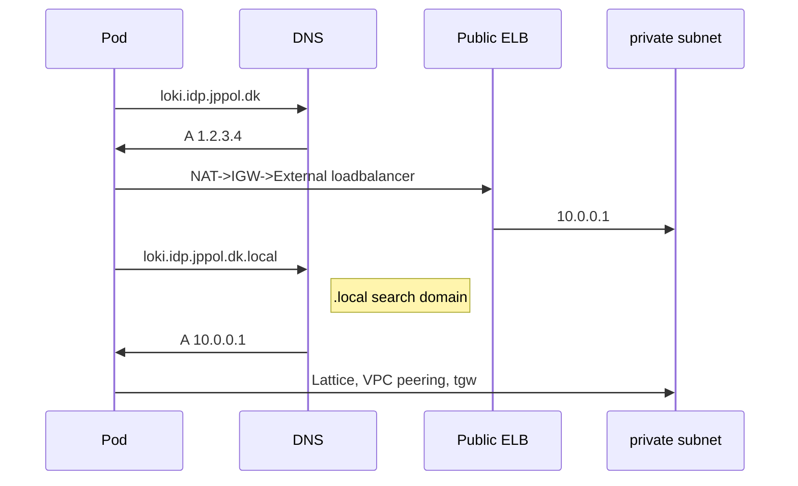

## Kubernetes network 

- Kube-proxy router trafik til/fra pods, vha iptables, og den stiller virutelle Services (ClusterIP, NodePort, L4 LoadBalancer) til rådighed. Kubernetes bruger altså nodes som "native sidecar" til ClusterIP, NodePort og L4 loadbalancer. 
- Disse virtuelle Services, inkl. Virtual IPs, eller VIPs, er virtuelle i en sådan grad, at de kun eksisterer i kube-proxy (iptables ?) og dermed er der ikke behov for at flytte ip addresser ved nedbrud eller genstart af node. Det må være kubelets og control plane der vedligeholder denne "service discovery".
- L7 loadbalancers er ingress controllers der kører fx nginx eller AWS loadbalancer controller der kører fx ALB. 
- Routing i noden sker ved at iptables (kube-proxy) intercepter trafik og omskriver egress som SNAT og ingress som DNAT (det må blive enorme iptables) - tilgengæld er det grunden til, at pods kan være på overlappende subnets.
- L4 loadbalancer kan udskiftes med IPVS, hvis performance problemer.
- I alm kubernetes tilknyttes pods til noder med bridge eller vswitch - men i EKS bruges typisk VPC CNI, der router trafik til pods via subnet routetables i VPC. Dermed er pods synlige i VPC network og integrere native med security groups, routing og loadbalancers.
- Lavpraktisk i linux er hver pod et veth pair, med et ben i pod'en (isoleret network namespace) og det andet i linux root namespace.
- VPC CNI opretter GW IP as a manual arp entry in the pod -> veth interface i node's root namespace. 

- Hver EC2 instans type har et max default antal pods (interfaces * IPs pr interface - 1): [info](https://docs.aws.amazon.com/ec2/latest/instancetypes/gp.html#gp_network) og [pod-calculator](https://github.com/awslabs/amazon-eks-ami/blob/main/templates/al2/runtime/max-pods-calculator.sh)
  - m5.large = 29
  - m5.xlarge = 59
  - m4.4xlarge = 239
(default max pods pr node er 110, men det kan potentielt forøges med [prefix delegation](https://docs.aws.amazon.com/eks/latest/userguide/cni-increase-ip-addresses.html)

## IPcalc
```
10.144.0.0/12 = 16 b-nets = 16 clustes = 5 (dev/test/prod kubernetes platforme)  
750 public ips, 3000 private ips:
Public1:  10.144.0.0/24
Public2:  10.144.1.0/24
Public3:  10.144.2.0/24
Spare:    10.144.3.0/24
Private1: 10.144.4.0/22
Private2: 10.144.8.0/22
Private3: 10.144.12.0/22
Spare:    10.144.16.0/22
```
256 /20 nets = 4096 c-nets - alternativt bruge cgnat: 100.64.0.0/10 = 64 b-nets = 16384 c-nets

## VPC subnet configuration
1. I private mode etableres kun private subnets, og trafik kan dermed ikke modtages fra internettet.
1. I public mode er alle noder og Services i public subnets mens pods (måske også private Services?) er i private, nu evt overlappende, subnets.
1. I private and public mode er nodes og pods og private Services i private subnets, public Services er i public subnets.

### Cluster i public mode
Public: 10.144.0.0/22 = 750 ips pr cluster = 64 clusters = 20 teams  
Private: 172.17.0.0/16 = rigeligt  

### Cluster i private and public mode
Public: 10.144.0.0/24 = 4 /26 nets = 192 ips = 48 (64) clusters = 16 teams  
Private: 10.144.128.0/22 = 4 c-nets = 750 ips = 48 clusters = 16 teams  


## NAT vs TGW

**NAT** cost (250 kr/mdr)  
Egress NAT: $0.045/GB  
Egress to internet : $0.09 per GB  
**1 DKK pr GB**  
  
**TGW** cost (255 kr/mdr)  
Price per GB of data processed ($)	$0.02 [info](https://aws.amazon.com/transit-gateway/pricing/) or only 0.01$ [here](https://aws.amazon.com/ec2/pricing/on-demand/)  
**15 øre pr GB**  
  
Derudover:
Inter-az: $0.01/GB in each direction  
**10 øre pr GB**  
  
VPC peering:  
Vpc peering same az is free.  
Vpc peering cross-az is $0.01/GB in each direction.  
10 øre pr GB  

Options:  
Centralised egress ?  
https://kubernetes.io/docs/concepts/services-networking/topology-aware-routing/  

General tips:  
Avoid routing traffic over the internet when connecting to AWS services from within AWS by using VPC endpoints:  
* VPC gateway endpoints allow communication to Amazon S3 and Amazon DynamoDB without incurring data transfer charges within the same Region.
* VPC interface endpoints are available for some AWS services. This type of endpoint incurs hourly service charges and data transfer charges.
Traffic that crosses an Availability Zone boundary typically incurs a data transfer charge. Use resources from the local Availability Zone whenever possible.  
   
https://aws.amazon.com/blogs/architecture/overview-of-data-transfer-costs-for-common-architectures/  


## DNS og NAT

I forbindelse med cross-cluster trafik, er det nemmeste nok altid at al trafik går ud af en nat gateway og ind af en public loadbalancer. Men hvad hvis man en dag vil route trafik internt ? Hvis vi allokerer subnets hensigtsmæssigt, kan det vel ikke skade.

Antagelse:
1. Clusters tildeles subdomain **clusterX.idp.jppol.dk** - dvs CoreDNS i clusterX er autorativ ?
1. CoreDNS sørger for at workload er tilgængelig internt på ```<workload>[.<namespace>][.clusterX.idp.jppol.dk.local]```
1. CoreDNS sørger for at evt. public endpoint er tilgængelig på ```<workload>[.<namespace>].clusterX.idp.jppol.dk```

1. CoreDNS sørger for at ```loki.idp.jppol.dk -> public loadbalancer```, via external dns plugin ?
1. CoreDNS sørger for at ```loki.idp.jppol.dk.local -> internal loadbalancer```, via external dns plugin ?

1. CoreDNS default dnsPolicy inkluderer ```search domain .local```

Hermed vil det være muligt i fremtiden at route trafik internt med vpc peering eller tgw, så længe subnets ikke overlapper.
Hvis subnets overlapper kan Aws lattice bruges èn service ad gangen, eller der kan laves NAT, eller istio/cillium overlay mesh.




Altså, koa har et namespace med følgende dns suffix: ```koa-dev.idp.jppol.dk``` og udstiller kun service ```test``` :
1. public loadbalancer,  ```test.koa-dev.idp.jppol.dk```       (1.1.1.1)
1. private loadbalancer, ```test.koa-dev.idp.jppol.dk.local``` (10.114.0.1)
samt. 
1. public loadbalancer,  ```test.jyllands-posten.dk```         (1.1.1.1)
1. private loadbalancer, ```test.jyllands-posten.dk.local```   (10.114.0.1) 

Pods i namespace koa-dev har search domains:
```koa-dev.idp.jppol.dk.local og jyllands-posten.dk.local```
1. ```dig test                       --> test.koa-dev.idp.jppol.dk.local (10.114.0.1) idp-private-zone```  
1. ```dig test.koa-dev.idp.jppol.dk. --> test.koa-dev.idp.jppol.dk       (1.1.1.1)    idp-public-zone```
1. ```dig test.jyllands-posten.dk    --> test.jyllands-posten.dk.local   (10.114.0.1) idp-private-zone```
1. ```dig test.jyllands-posten.dk.   --> test.jyllands-posten.dk         (1.1.1.1)    idp-public-zone```
1. ```dig idiot.jyllands-posten.dk   --> idiot.jyllandsposten.dk         (2.2.2.2)     jp-public-zone```  
