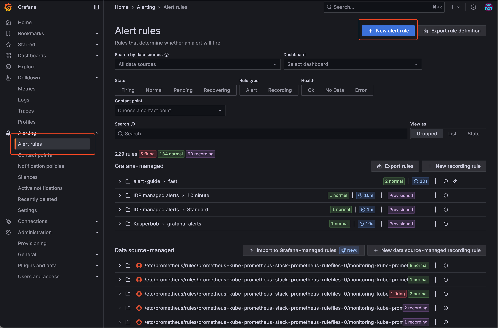
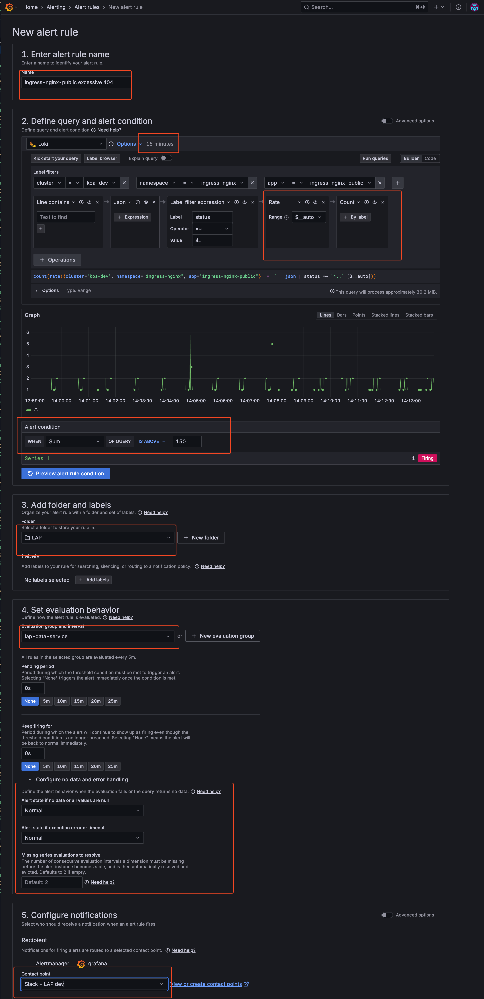
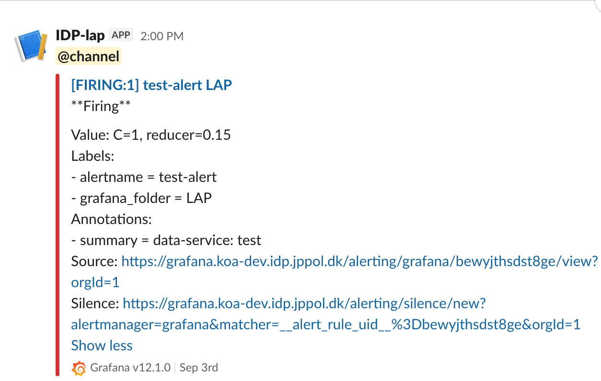

# Alerting

# Table of Contents
- [Main Steps When Creating a New Alert Rule](#main-steps-when-creating-a-new-alert-rule)
- [Additional Alert Settings](#additional-alert-settings)
- [Supported Data Sources for Alerting](#supported-data-sources-for-alerting)
- [Setting Up Alerts in Grafana Using Built-in Alerting](#setting-up-alerts-in-grafana-using-built-in-alerting)
   - [Setting Up Alerts via the Alerting Menu (Recommended)](#setting-up-alerts-via-the-alerting-menu-recommended)
   - [Setting Up Alerts via a Dashboard Panel](#setting-up-alerts-via-a-dashboard-panel)
   - [Setting Up Alerts via a Helm chart](#setting-up-alerts-via-a-helm-chart)
- [Requesting a Slack Contact Point](#requesting-a-slack-contact-point)
- [Further Plans for Alerting](#further-plans-for-alerting)
- [References](#references)

# Main Steps When Creating a New Alert Rule

When creating a new alert rule in Grafana, follow these main steps:

1. **Enter alert rule name**
2. **Define query and alert condition**
3. **Add folder and labels**
4. **Set evaluation behavior** (e.g., check interval, no data handling)
5. **Configure notifications** (choose Slack as the contact point)
6. **Configure notification message** (customize the message sent with the alert)

# Additional Alert Settings

When configuring alerts in Grafana, there are a few important settings to consider:

- **Check interval**: This determines how often Grafana evaluates the alert rule (e.g., every 1 minute). Set this according to how quickly you want to detect issues.
- **No data handling**: Decide what should happen if no data is returned by the query. It is recommended to treat "no data" as OK to avoid unnecessary or false alarms, especially for metrics or logs that may not always be present. However, be aware that this means you might miss some issues if data stops unexpectedly.

> **Recommendation:** Set "no data" to OK/Normal unless you have a specific reason to treat it as an alert. Always review this setting based on your use case.

# Supported Data Sources for Alerting

Grafana alerts can be created based on data from different sources:

- **Prometheus metrics**: You can create alerts directly on Prometheus metric queries.
- **Loki log lines**: You can also create alerts based on queries against Loki logs. However, to use Loki log lines for alerting, your query must produce a numeric value (for example, by using functions like `count()` or `sum()` in your query). Only numeric results can be used as the basis for alert conditions.

# Setting Up Alerts in Grafana Using Built-in Alerting

This guide explains how to set up alerts in Grafana using:
- The Alerting menu (recommended for most use cases)
- Dashboards (for panel-specific alerts)

Grafana's built-in alerting allows you to monitor your data and receive notifications when certain conditions are met.

---

## General Prerequisites

- Sufficient permissions to create alerts in Grafana
- A Slack contact point configured for your team (see [Requesting a Slack Contact Point](#requesting-a-slack-contact-point))
- Access to your team's monitoring data sources

## Setting Up Alerts via the Alerting Menu (Recommended)

### Steps

1. **Log in to Grafana**
   - Open your Grafana instance in a browser and log in.

2. **Go to Alerting > Alert rules**
   - In the left menu, click on "Alerting" and then select "Alert rules".
   - Click the "New alert rule" button to start creating a new alert rule.

3. **Define the Alert Rule**
   - Enter a name for your alert rule.
   - Define your query and alert condition (choose your data source, write your query, and set the condition).
   - Add a folder and any relevant labels (e.g., `severity`).
   - Set evaluation behavior (check interval, no data handling—see recommendations above).
   - Configure notifications by selecting your team's dedicated Slack contact point.
   - Optionally, customize the notification message.

4. **Save the Alert Rule**
   - Click "Save" to create the alert rule.

5. **Test the Alert**
   - If possible trigger the alert condition to verify notifications are sent as expected.

### Example: Creating an Alert Rule via the GUI

> **Note:** The following example is a fictional scenario and may not represent a meaningful or recommended real-world alert rule. The images are for guidance only; the Grafana GUI may change over time and the guide may not always reflect the latest interface. The most important elements are highlighted with red boxes in the screenshots to help you identify key areas.

**Example scenario:**
This alert monitors the nginx-public ingress controller for HTTP 4xx responses within the last 15 minutes. If more than 150 such responses are detected, a Slack alert is sent to the contact point for our LAP team's dev environment.

Below is an example walkthrough with screenshots illustrating the process:

1. **Navigate to Alert Rules and choose New alert rule**
   
   

2. **Configure alert**
   
   

3. **Configure Evaluation Group**
   You can define an existing evaluation group or create a new one.
   In this example, I'm using an existing evaluation group created by the LAP team.
   - If creating new: Set evaluation interval and folder location
   - If using existing: Select from the dropdown menu

4. **Save and Verify**
   - Click "Save and exit" to create the alert rule
   - Your alert is now active and will appear in the Alert Rules list
   - The alert will begin evaluating based on your configured interval

5. **Example: Alert in Slack**
   
   
   
   This is how an alert would appear in the relevant Slack channel when triggered.

---

## Setting Up Alerts via a Dashboard Panel

### Steps

1. **Log in to Grafana**

2. **Create or Open a Dashboard**
   - Navigate to the dashboard where you want to add an alert.
   - You can create a new dashboard or use an existing one.

3. **Add a Panel**
   - Click on "Add panel" and configure your query as needed.

4. **Configure Alert**
   - In the panel editor, go to the "Alert" tab.
   - Click "Create alert rule".
   - Set the conditions for your alert (e.g., when a metric is above/below a threshold).
   - Configure evaluation interval and other settings.

5. **Set Notification Channel**
    - Under "Notifications", select your Slack integration as the notification channel. Alerts will be sent to the predefined Slack channel configured in the integration.

6. **Add Labels to the Alert**
   - You can add standard labels to your alert for categorization and organization:
     - `severity`: Indicate the importance of the alert (e.g., `critical`, `warning`)
   - Example:
     ```yaml
     labels:
       severity: "critical"
     ```
   - These labels help with alert organization and filtering in the Grafana interface.

7. **Save the Panel**
   - Click "Apply" to save the panel and alert rule.

8. **Test the Alert**
   - Trigger the alert condition to verify notifications are sent as expected.

---

## Setting Up Alerts via a Helm Chart

> **Note:** The current procedure for provisioning alerts programmatically in Grafana is rather difficult and requires careful management of configuration files and unique identifiers. We hope that the new official Grafana-supported provisioning method (currently in beta) will make this process much easier to manage in the future.

> **TIP:** The easiest way to create alerts via Helm chart is to first set up the alert in the Grafana GUI, then export it as JSON. This provides you with all the necessary configuration, including datasource IDs and other variables that are difficult to find manually.

### Using the helm-idp-grafana-alarm Chart

The recommended way to deploy Grafana alert rules via ConfigMap is to use the `idp-grafana-alarm` Helm chart. This chart handles the creation and management of the ConfigMap and ensures proper integration with your Grafana instance.

### Steps to Deploy

1. **Create the Alert in GUI First**
   - Set up your alert rule in the Grafana UI following the steps in the previous sections
   - Export the alert configuration as JSON (available in the alert rule details)
   - Use this exported JSON to populate your Helm values file

2. **Prepare Your Helm Values File**
   - Create a values.yaml file for the idp-grafana-alarm chart
   - Include your alert rule configuration from the exported JSON

3. **Set Up and Deploy with ArgoCD**
   - Set up a new ArgoCD Application in your apps repository for your alert configuration. 
   
   > **Note:** Chart versions are updated regularly. Always check your Helm repository or internal documentation for the current recommended version of `idp-grafana-alarm`.

   Create an `application.yaml` like this:
     ```yaml
     apiVersion: v2
     name: grafana-alarm-test
     description: A Helm chart for setting up Grafana alarms
     version: 0.1.0
     helm:
       chart: helm/idp-grafana-alarm
       chartVersion: "0.1.2"
     ```
   - Make sure to reference the `values.yaml` file you prepared with your alert configuration.
   - Commit both the `application.yaml` and your `values.yaml` to your Apps repository.
   - ArgoCD will then deploy the Helm chart and provision your alerts automatically.

### Example Values.yaml File

> **Note:** It is important to change the `rules: uid` value for each alert to something unique. This ensures that each alert is managed and updated correctly by Grafana and avoids conflicts during provisioning.

> **Note:** All UIDs, datasource references, and configuration values in this guide are examples. Replace them with actual values from your Grafana instance.

Here's a complete example of a values.yaml file for the idp-grafana-alarm chart:

```yaml
# Values for Grafana Alert ConfigMap
# Name of the ConfigMap (optional, will use release name if not specified)
nameOverride: ""
fullnameOverride: ""

# Metadata configurations (optional, for adding additional custom metadata)
metadata:
  annotations: {}
    # Add custom annotations here (in addition to the default ones)
    # example.com/custom-annotation: "value"
  labels: {}
    # Add custom labels here (in addition to the default ones)
    # custom-label: "value"

# ConfigMap data
# You can define multiple configurations using different keys
config:
  # Default configuration (will use "grafana-alert-[release-name].yaml" as filename)
  default: |-
    apiVersion: 1
    groups:
      - orgId: 1
        name: grafana-alerts
        folder: test-alerts
        interval: 10s
        rules:
          - uid: 3qv9xk7e6a4msb
            title: grafana-alert-loki-text-search-test
            condition: C
            data:
              - refId: A
                queryType: instant
                relativeTimeRange:
                  from: 900
                  to: 0
                datasourceUid: P8E80F9AEF21F6940
                model:
                  editorMode: code
                  expr: sum(count_over_time({container="linkerd-proxy"} |= `invalid peer certificate` | logfmt [$__auto]))
                  instant: true
                  intervalMs: 1000
                  maxDataPoints: 43200
                  queryType: instant
                  refId: A
              - refId: C
                datasourceUid: __expr__
                model:
                  conditions:
                    - evaluator:
                        params:
                          - 1
                        type: gt
                      operator:
                        type: and
                      query:
                        params:
                          - C
                      reducer:
                        params: []
                        type: last
                      type: query
                  datasource:
                    type: __expr__
                    uid: __expr__
                  expression: A
                  intervalMs: 1000
                  maxDataPoints: 43200
                  refId: C
                  type: threshold
            noDataState: OK
            execErrState: OK
            annotations:
              summary: |-
                Test alert
                Please check IDP-469 for details
            labels:
              severity: low
            isPaused: false
            notification_settings:
              receiver: slack-idp-test-provisioned
  
  # Example of adding a second configuration (will use "grafana-alert-[release-name]-another-alert.yaml" as filename)
  # Uncomment and modify if needed
  # another-alert: |-
  #   apiVersion: 1
  #   groups:
  #     - orgId: 1
  #       name: another-grafana-alert-group
  #       folder: Monitoring
  #       interval: 30s
  #       rules:
  #         - uid: abcdefg123456
  #           title: another-example-alert
  #           condition: C
  #           # ... rest of the alert configuration
```

#### Key Elements of the Configuration:
- **config.default**: Contains the main alert configuration. The content here comes from exporting your alert from the Grafana UI.
- **datasourceUid**: Unique identifier for your data source (in the example: P8E80F9AEF21F6940 for Loki). This is why it's easier to configure in the UI first.
- **notification_settings.receiver**: Specifies which Slack contact point to use (e.g., slack-idp-test-provisioned).
- **Multiple configurations**: You can define multiple alert configurations under different keys in the config section.

This approach ensures that your alerts are properly configured with all the necessary IDs and references, and the Helm chart handles the integration with Grafana automatically.

### Deleting a Provisioned Alert

Deleting a provisioned alert is not as simple as just undeploying the application or removing the alert from your Helm values. Grafana requires a special delete manifest to be deployed in order to remove the alert rule from the system.

Since direct deployment of raw Kubernetes manifests is not available, you should use the same Helm chart (`idp-grafana-alarm`) as when deploying alerts, but with a values.yaml that uses the `deleteRules` syntax.

#### Example values.yaml for Deleting an Alert

```yaml
config:
  delete-alert-<uid>: |-
    apiVersion: 1
    deleteRules:
      - orgId: 1
        uid: aeq3xvx67mx34s
```

**Important:**
- You must update the `uid` and `orgId` fields to match the alert you want to delete.
- The key under `config:` (here `delete-alert`) and the filename it generates should be unique for the delete operation.
- Deploy this values.yaml using the same Helm chart and ArgoCD process as for creating alerts.

After the alert has been deleted and is no longer present in Grafana, you can safely remove the corresponding ArgoCD `application.yaml` (and the delete values.yaml) from your repository to fully clean up the provisioned alert and its deployment resources.

---

### Debugging Provisioned Alerts

If your alert does not appear in Grafana or you suspect a provisioning error, you can check the Grafana logs for issues related to alert provisioning. Use the following Loki query to search for relevant logs:

```logql
{namespace="monitoring", app="grafana", container="grafana-sc-alerts"} | logfmt | lokiPath != `/loki/api/v1/query_range`
```

This query will help you see if your alert rule was provisioned and if any errors were encountered during the process.

---

## Requesting a Slack Contact Point

Each team must have a dedicated Slack contact point (webhook) for their alert notifications. To set up a proper Slack contact point, you need:

1. **A Slack channel** where alerts will be sent. This can be an existing team channel or a dedicated alerts channel.
2. **A Slack webhook integration URL** for that channel, which allows Grafana to post messages to the channel.

If your team does not already have a Slack contact point set up for your desired channel, please request one by contacting the IDP team with the following information:

- The name of your Slack channel (e.g., `#teamname-environment-alerts`)

The IDP team will configure the Slack webhook integration and set up the contact point in Grafana. Alerts will only be delivered to channels with a properly configured contact point.

## Further Plans for Alerting

We may consider integrating with `incident.io` in the future to enable more advanced routing and incident management features. For now, all alerting is handled directly via Slack contact points in each Grafana installation.

## References

- [Grafana Alerting Documentation](https://grafana.com/docs/grafana/latest/alerting/)
- [Provisioning Alert Rules](https://grafana.com/docs/grafana/latest/alerting/manage-alerts/provision-alerts/)
- [LogQL Documentation](https://grafana.com/docs/loki/latest/logql/)
- [Grafana Alert Rule API](https://grafana.com/docs/grafana/latest/developers/http_api/alerting/)

If you have any questions, refer to the official Grafana documentation or contact the IDP team.
