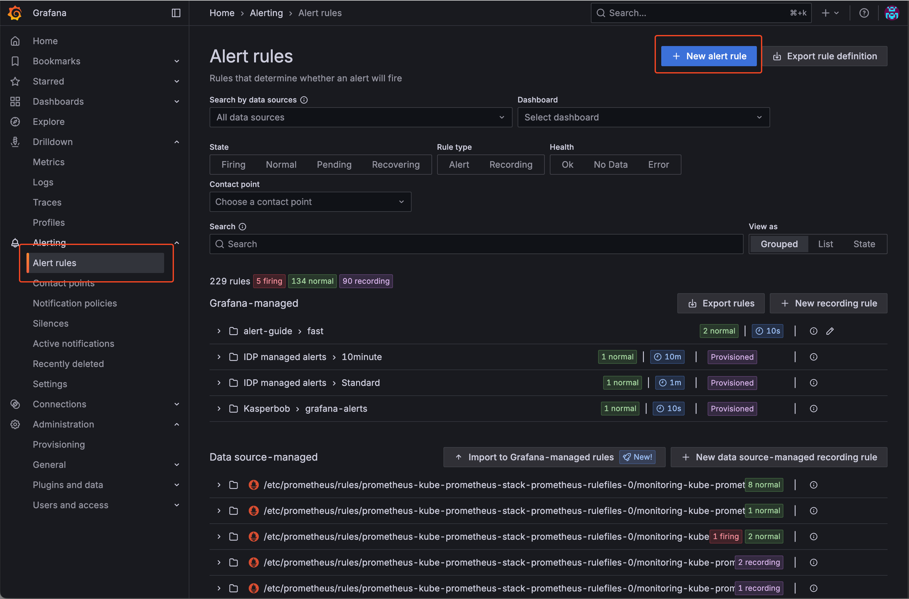
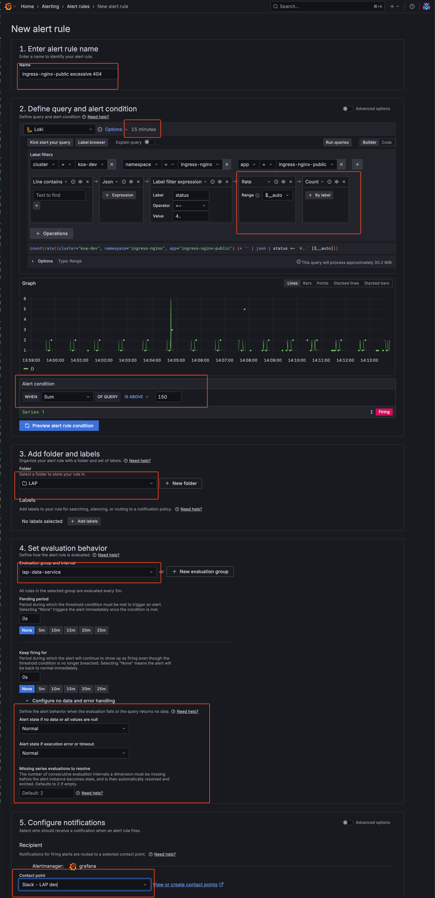
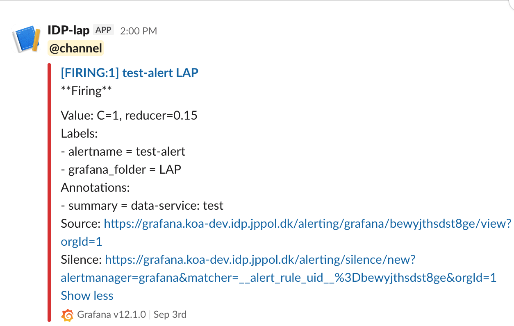

# Alerting

# Table of Contents
- [Main Steps When Creating a New Alert Rule](#main-steps-when-creating-a-new-alert-rule)
- [Additional Alert Settings](#additional-alert-settings)
- [Supported Data Sources for Alerting](#supported-data-sources-for-alerting)
- [Setting Up Alerts in Grafana Using Built-in Alerting](#setting-up-alerts-in-grafana-using-built-in-alerting)
   - [Setting Up Alerts via the Alerting Menu (Recommended)](#setting-up-alerts-via-the-alerting-menu-recommended)
   - [Setting Up Alerts via a Dashboard Panel](#setting-up-alerts-via-a-dashboard-panel)
- [Setting Up Alerts as Code (Helm Chart)](#setting-up-alerts-as-code-helm-chart)
  - [Step 1: Create and Test in the GUI](#step-1-create-and-test-in-the-gui)
  - [Step 2: Export the Alert Rule](#step-2-export-the-alert-rule)
  - [Step 3: Create Helm Values](#step-3-create-helm-values)
  - [Step 4: Deploy via ArgoCD](#step-4-deploy-via-argocd)
  - [Deleting an Alert](#deleting-an-alert)
- [Requesting a Slack Contact Point](#requesting-a-slack-contact-point)
- [References](#references)

# Main Steps When Creating a New Alert Rule

When creating a new alert rule in Grafana, follow these main steps:

1. **Enter alert rule name**
2. **Define query and alert condition**
3. **Add folder and labels**
4. **Set evaluation behavior** (e.g., check interval, no data handling)
5. **Configure notifications** (choose Slack as the contact point)
6. **Configure notification message** (customize the message sent with the alert)

# Additional Alert Settings

When configuring alerts in Grafana, there are a few important settings to consider:

- **Check interval**: This determines how often Grafana evaluates the alert rule (e.g., every 1 minute). Set this according to how quickly you want to detect issues.
- **No data handling**: Decide what should happen if no data is returned by the query. It is recommended to treat "no data" as OK to avoid unnecessary or false alarms, especially for metrics or logs that may not always be present. However, be aware that this means you might miss some issues if data stops unexpectedly.

> **Recommendation:** Set "no data" to OK/Normal unless you have a specific reason to treat it as an alert. Always review this setting based on your use case.

# Supported Data Sources for Alerting

Grafana alerts can be created based on data from different sources:

- **Prometheus metrics**: You can create alerts directly on Prometheus metric queries.
- **Loki log lines**: You can also create alerts based on queries against Loki logs. However, to use Loki log lines for alerting, your query must produce a numeric value (for example, by using functions like `count()` or `sum()` in your query). Only numeric results can be used as the basis for alert conditions.

# Setting Up Alerts in Grafana Using Built-in Alerting

This guide explains how to set up alerts in Grafana using:
- The Alerting menu (recommended for most use cases)
- Dashboards (for panel-specific alerts)

Grafana's built-in alerting allows you to monitor your data and receive notifications when certain conditions are met.

---

## General Prerequisites

- Sufficient permissions to create alerts in Grafana
- A Slack contact point configured for your team (see [Requesting a Slack Contact Point](#requesting-a-slack-contact-point))
- Access to your team's monitoring data sources

## Setting Up Alerts via the Alerting Menu (Recommended)

### Steps

1. **Log in to Grafana**
   - Open your Grafana instance in a browser and log in.

2. **Go to Alerting > Alert rules**
   - In the left menu, click on "Alerting" and then select "Alert rules".
   - Click the "New alert rule" button to start creating a new alert rule.

3. **Define the Alert Rule**
   - Enter a name for your alert rule.
   - Define your query and alert condition (choose your data source, write your query, and set the condition).
   - Add a folder and any relevant labels (e.g., `severity`).
   - Set evaluation behavior (check interval, no data handling—see recommendations above).
   - Configure notifications by selecting your team's dedicated Slack contact point.
   - Optionally, customize the notification message.

4. **Save the Alert Rule**
   - Click "Save" to create the alert rule.

5. **Test the Alert**
   - If possible trigger the alert condition to verify notifications are sent as expected.

### Example: Creating an Alert Rule via the GUI

> **Note:** The following example is a fictional scenario and may not represent a meaningful or recommended real-world alert rule. The images are for guidance only; the Grafana GUI may change over time and the guide may not always reflect the latest interface. The most important elements are highlighted with red boxes in the screenshots to help you identify key areas.

**Example scenario:**
This alert monitors the nginx-public ingress controller for HTTP 4xx responses within the last 15 minutes. If more than 150 such responses are detected, a Slack alert is sent to the contact point for our LAP team's dev environment.

Below is an example walkthrough with screenshots illustrating the process:

1. **Navigate to Alert Rules and choose New alert rule**
   
   

2. **Configure alert**
   
   

3. **Configure Evaluation Group**
   You can define an existing evaluation group or create a new one.
   In this example, I'm using an existing evaluation group created by the LAP team.
   - If creating new: Set evaluation interval and folder location
   - If using existing: Select from the dropdown menu

4. **Save and Verify**
   - Click "Save and exit" to create the alert rule
   - Your alert is now active and will appear in the Alert Rules list
   - The alert will begin evaluating based on your configured interval

5. **Example: Alert in Slack**
   
   
   
   This is how an alert would appear in the relevant Slack channel when triggered.

---

## Setting Up Alerts via a Dashboard Panel

### Steps

1. **Log in to Grafana**

2. **Create or Open a Dashboard**
   - Navigate to the dashboard where you want to add an alert.
   - You can create a new dashboard or use an existing one.

3. **Add a Panel**
   - Click on "Add panel" and configure your query as needed.

4. **Configure Alert**
   - In the panel editor, go to the "Alert" tab.
   - Click "Create alert rule".
   - Set the conditions for your alert (e.g., when a metric is above/below a threshold).
   - Configure evaluation interval and other settings.

5. **Set Notification Channel**
    - Under "Notifications", select your Slack integration as the notification channel. Alerts will be sent to the predefined Slack channel configured in the integration.

6. **Add Labels to the Alert**
   - You can add standard labels to your alert for categorization and organization:
     - `severity`: Indicate the importance of the alert (e.g., `critical`, `warning`)
   - Example:
     ```yaml
     labels:
       severity: "critical"
     ```
   - These labels help with alert organization and filtering in the Grafana interface.

7. **Save the Panel**
   - Click "Apply" to save the panel and alert rule.

8. **Test the Alert**
   - Trigger the alert condition to verify notifications are sent as expected.

---

## Setting Up Alerts as Code (Helm Chart)

The `idp-grafana-alarm` Helm chart lets you manage Grafana alert rules as code via Kubernetes CRDs. Alerts are deployed through ArgoCD and automatically synced to Grafana via the grafana-operator.

The recommended workflow is: **create and test in the GUI first**, then export and convert to Helm values for permanent deployment.

### Prerequisites

- A working alert rule tested in the Grafana GUI
- A Slack contact point configured for your team (see [Requesting a Slack Contact Point](#requesting-a-slack-contact-point))
- Access to your team's apps repository (e.g., `apps-idp`)

### Step 1: Create and Test in the GUI

Follow the steps in the sections above to create your alert rule in the Grafana UI. Make sure the alert fires correctly and notifications arrive in your Slack channel before proceeding.

### Step 2: Export the Alert Rule

1. In Grafana, go to **Alerting > Alert rules**
2. Find your alert rule and click on it to open the details
3. Click the **Export** button and choose the **YAML** tab
4. Click **Copy code** or **Download**

The exported YAML looks like this:

```yaml
apiVersion: 1
groups:
  - orgId: 1
    name: my-alert-group
    folder: My Folder
    interval: 1m
    rules:
      - uid: abc123xyz
        title: High Error Rate
        condition: C
        data:
          - refId: A
            relativeTimeRange:
              from: 600
              to: 0
            datasourceUid: prometheus
            model:
              datasource:
                type: prometheus
                uid: prometheus
              expr: 'rate(http_requests_total{status=~"5.."}[5m]) > 0.1'
              instant: true
              range: false
              refId: A
          - refId: C
            datasourceUid: __expr__
            model:
              conditions:
                - evaluator:
                    params:
                      - 0
                    type: gt
                  operator:
                    type: and
                  query:
                    params:
                      - A
                  reducer:
                    params: []
                    type: last
                  type: query
              datasource:
                type: __expr__
                uid: __expr__
              expression: A
              refId: C
              type: threshold
        noDataState: OK
        execErrState: OK
        for: 5m
        annotations:
          summary: "High error rate detected"
        labels:
          severity: warning
        isPaused: false
        notification_settings:
          receiver: "Slack - My Team"
```

### Step 3: Create Helm Values

The exported YAML maps directly to the chart's `values.yaml`. You only need to:

1. **Remove** the wrapper lines (`apiVersion`, `groups`, `orgId`, `folder`)
2. **Add** `folder` and `interval` at the top
3. **Paste** the `rules` block as-is — no changes needed, including `notification_settings`

```yaml
# Choose ONE of these folder options:

# Option A: Create a new folder for your team's alerts
folder: "My Team Alerts"

# Option B: Use an existing folder (set folder to empty, specify folderRef)
# folder: ""
# folderRef: "idp-managed-alerts"

# Evaluation interval (from groups[].interval in the export)
interval: 1m

# Paste rules directly from the export — no modifications needed
rules:
  - uid: abc123xyz
    title: High Error Rate
    condition: C
    data:
      - refId: A
        relativeTimeRange:
          from: 600
          to: 0
        datasourceUid: prometheus
        model:
          datasource:
            type: prometheus
            uid: prometheus
          expr: 'rate(http_requests_total{status=~"5.."}[5m]) > 0.1'
          instant: true
          range: false
          refId: A
      - refId: C
        datasourceUid: __expr__
        model:
          conditions:
            - evaluator:
                params:
                  - 0
                type: gt
              operator:
                type: and
              query:
                params:
                  - A
              reducer:
                params: []
                type: last
              type: query
          datasource:
            type: __expr__
            uid: __expr__
          expression: A
          refId: C
          type: threshold
    noDataState: OK
    execErrState: OK
    for: 5m
    annotations:
      summary: "High error rate detected"
    labels:
      severity: warning
    isPaused: false
    notification_settings:
      receiver: "Slack - My Team"
```

To add more alerts later, simply append additional rules to the `rules` list and push the change.

### Step 4: Deploy via ArgoCD

1. In your apps repository (e.g., `apps-idp`), create a directory for your alerts under `apps/<namespace>/`:

   **`application.yaml`:**
   ```yaml
   apiVersion: v2
   name: my-team-alerts
   description: Grafana alerts for my team
   version: 0.1.0
   helm:
     chart: helm/idp-grafana-alarm
     chartVersion: "1.0.1"  # see latest version at https://github.com/jppol-idp/helm-idp/releases
   ```

2. Add the `values.yaml` you created in step 3

3. Commit and push to `main` — ArgoCD will deploy the alert rules automatically

### Deleting an Alert

With the grafana-operator approach, deleting alerts is straightforward: simply remove the alert rule from your `values.yaml` (or remove the entire ArgoCD application) and push the change. The grafana-operator handles cleanup automatically via Kubernetes finalizers — no special delete manifests needed.

---

## Requesting a Slack Contact Point

Each team must have a dedicated Slack contact point (webhook) for their alert notifications. To set up a proper Slack contact point, you need:

1. **A Slack channel** where alerts will be sent. This can be an existing team channel or a dedicated alerts channel.
2. **A Slack webhook integration URL** for that channel, which allows Grafana to post messages to the channel.

If your team does not already have a Slack contact point set up for your desired channel, please request one by contacting the IDP team with the following information:

- The name of your Slack channel (e.g., `#teamname-environment-alerts`)

The IDP team will configure the Slack webhook integration and set up the contact point in Grafana. Alerts will only be delivered to channels with a properly configured contact point.

## References

- [Grafana Alerting Documentation](https://grafana.com/docs/grafana/latest/alerting/)
- [Provisioning Alert Rules](https://grafana.com/docs/grafana/latest/alerting/manage-alerts/provision-alerts/)
- [LogQL Documentation](https://grafana.com/docs/loki/latest/logql/)
- [Grafana Alert Rule API](https://grafana.com/docs/grafana/latest/developers/http_api/alerting/)

If you have any questions, refer to the official Grafana documentation or contact the IDP team.
