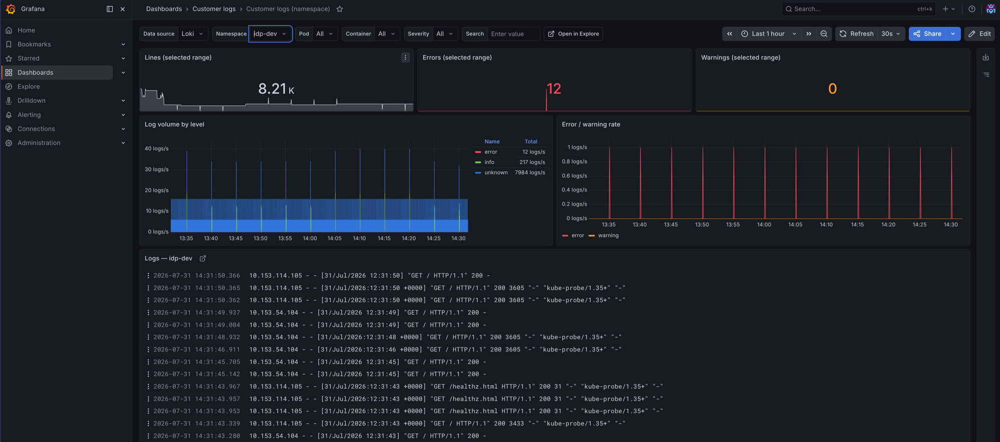
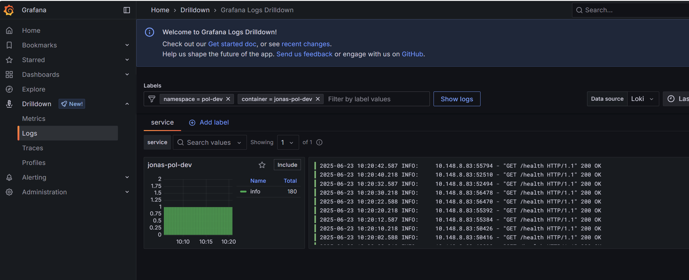
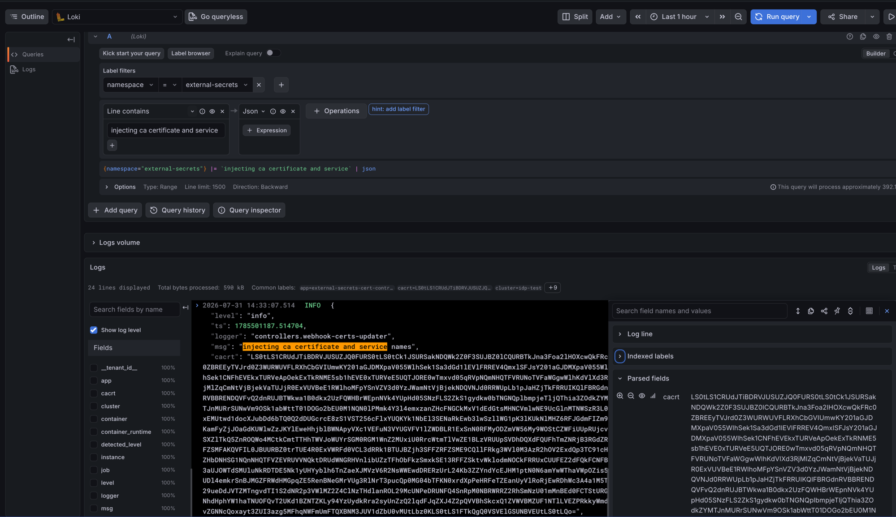

# Application logging

Everything your containers write to stdout and stderr is collected automatically and stored in Loki, where you can query it from your cluster's Grafana. You don't have to configure anything, install an agent, or ship logs yourself. If your pod prints it, it is queryable.

This guide covers where your logs go and how to query them, how to log in a way that stays useful and affordable, and how long logs are kept and what that means for sensitive data.

For ingress access logs (which client got a 403, which request was slow) see [Reading ingress access logs in Grafana](/how-to/ingress-access-logs.html). Same tools, different log stream.

## Table of contents

**[Reading your application logs in Grafana](#reading-your-application-logs-in-grafana)**
- [Where your logs go](#where-your-logs-go)
- [Quick start: the Customer logs dashboard](#quick-start-the-customer-logs-dashboard)
- [Browsing logs without writing queries](#browsing-logs-without-writing-queries)
- [Querying in Explore](#querying-in-explore)
- [Labels you can filter on](#labels-you-can-filter-on)
- [Example queries](#example-queries)
- [Limits worth knowing](#limits-worth-knowing)

**[Logging best practices](#logging-best-practices)**
- [Log in JSON if you can](#log-in-json-if-you-can)
- [Logs, metrics or a database](#logs-metrics-or-a-database)
- [Questions we get asked](#questions-we-get-asked)

**[Log retention and sensitive data](#log-retention-and-sensitive-data)**
- [Retention](#retention)
- [What happens when logs expire](#what-happens-when-logs-expire)
- [Sensitive data and PII](#sensitive-data-and-pii)
- [Questions we get asked](#questions-we-get-asked-1)

[Getting help](#getting-help)

# Reading your application logs in Grafana

## Where your logs go

1. Your container writes to **stdout / stderr**.
2. A log collector on each node picks the lines up and labels them with `namespace`, `pod`, `container`, `app` and `cluster`.
3. They are forwarded to a buffering tier in your own cluster, which writes them to disk before sending them on.
4. From there they go to a **central Loki** (one for test clusters, one for production clusters) and are stored in S3.
5. Your cluster's Grafana reads back only your own cluster's logs.

In normal operation logs are queryable within **seconds** of being written. The buffering tier in step 3 exists so that logs survive a network or platform outage: it keeps them on disk and replays them once the connection recovers, instead of dropping them. It does not delay your logs.

Log storage is isolated per cluster. The Grafana in your cluster can only read the logs from that cluster, so one team's cluster cannot query another's.

### Write to stdout, not to a file

**Only stdout and stderr are collected.** If your application writes its logs to a file, nothing picks that file up, nothing reaches Loki, and nothing appears in Grafana. This catches out most developers coming to Kubernetes from a server or virtual machine background, where writing to `/var/log/myapp.log` and rotating it was the correct thing to do.

Here it is not, for three reasons:

- **Nothing reads the file.** Collection happens outside your container, on the node, and it only sees the container's console output. A file inside the container is invisible to it.
- **The file disappears with the pod.** Containers are replaced on every deploy, every scale-down and every node replacement. A log file lives and dies with the container that wrote it, so the logs you most want after a crash are the ones most likely to be gone.
- **It fills the node.** The container filesystem is node disk. An application writing logs to a file with no rotation can fill that disk and get itself, and its neighbours, evicted.

The fix is a configuration change, not a rewrite. Every common framework ships a console appender:

| Stack | Use |
|---|---|
| Java (Logback, Log4j2) | `ConsoleAppender` instead of `FileAppender` or `RollingFileAppender` |
| .NET (Serilog, NLog) | `WriteTo.Console()` / the console target |
| Node.js (Winston, Pino) | Console transport, or Pino's default stdout |
| Python | `logging.StreamHandler()` instead of `FileHandler` |
| Go | The default `log` output, or your logger pointed at stderr |

Write one event per line, do not add your own rotation, and do not compress anything. Rotation, retention and storage are the platform's job from the moment the line reaches the console.

There is no sidecar or agent available to tail a file for you. If your application genuinely cannot log to the console, raise it with the IDP team before you build around it.

## Quick start: the Customer logs dashboard

The fastest way in is the ready-made dashboard:

1. Open your cluster's Grafana
2. Go to **Dashboards**, folder **Customer logs**, dashboard **Customer logs (namespace)**
3. Pick your **namespace** at the top, then optionally narrow by **pod**, **container**, **severity** or a free-text **search**



The dashboard shows total lines, errors and warnings for the selected range, log volume broken down by level, and the log lines themselves. The **Open in Explore** link next to the variables carries your current filters over to Explore when you want to dig further.

The example above is also a good illustration of [happy-path logging](#happy-path-logging): of roughly 8,000 lines in an hour, nearly all are successful healthcheck requests that nobody will ever read.

Alert notifications from [IDP-managed alerts](/how-to/idp-managed-alerts.html) link straight into this dashboard, pre-filtered to the namespace and pod that triggered them.

## Browsing logs without writing queries

If you would rather click than type, Grafana's **Logs Drilldown** is the way in. Open **Drilldown** in the left-hand menu and pick **Logs**, then narrow down by picking label values such as your namespace and container. No LogQL involved.



Drilldown is good for getting oriented: what is this container emitting right now, which containers are the loudest, roughly when did the pattern change. Once you know what you are looking for, Explore and LogQL give you the precision.

## Querying in Explore

The examples in this guide all use the same imaginary setup: a namespace called `my-namespace` running an application labelled `checkout`, whose container is called `api`. Substitute your own names.

For free-form queries:

1. Open your cluster's Grafana and go to **Explore**
2. Pick the **Loki** datasource
3. Query your namespace:

    ```
    {namespace="my-namespace"}
    ```

Narrow to one app or container:

```
{namespace="my-namespace", container="api"}
```

### Filter on the raw line before parsing

Loki is fastest when you throw away irrelevant lines with a **line filter** (`|=`, `!=`, `|~`) before you apply any parser (`| json`, `| logfmt`). The parser then only runs on the lines that survived:

```
{namespace="my-namespace", container="api"}
  |= "order-id-4711"
  | json
```

Label selector first, line filter second, parser last. On a busy namespace this is the difference between a query that returns instantly and one that times out.

The same order applies if you prefer Grafana's visual query builder over typing LogQL: add the label filters, then a **Line contains** operation, then a **Json** operation. [The screenshot further down](#log-in-json-if-you-can) shows what that looks like.

### Severity

If your app logs in JSON or logfmt with a level field, Loki detects it automatically and exposes it as `detected_level`:

```
{namespace="my-namespace"} | detected_level=~"error|warn"
```

If your logs are plain unstructured text, `detected_level` will mostly be `unknown`. Fall back to a regex line filter:

```
{namespace="my-namespace"} |~ "(?i)(error|fatal|panic)"
```

Structured logging (JSON or logfmt) is worth it for this alone. See [Log in JSON if you can](#log-in-json-if-you-can).

## Labels you can filter on

These are Loki **stream labels**. Use them inside the `{...}` selector:

| Label | Value |
|---|---|
| `namespace` | Your Kubernetes namespace |
| `pod` | Pod name |
| `container` | Container name within the pod |
| `app` | The pod's `app.kubernetes.io/name` label, when set |
| `job` | `<namespace>` (compatibility label) |
| `cluster` | The cluster name (e.g. `koa-prod`) |
| `service_name` | Service name derived by Loki |

`detected_level` is **not** a stream label. It is detected per log line, so use it after the selector (`| detected_level="error"`) rather than inside `{...}`.

Everything else, such as request IDs, user IDs and status codes, lives in the log line itself and is reached with a line filter or a parser.

## Example queries

**All errors in your namespace:**
```
{namespace="my-namespace"} | detected_level="error"
```

**One request across all pods of a service:**
```
{namespace="my-namespace", app="checkout"} |= "req-9f2c41"
```

**Exclude a noisy healthcheck line:**
```
{namespace="my-namespace", container="api"} != "GET /healthz"
```

**A field from your JSON logs:**
```
{namespace="my-namespace", container="api"}
  |= "payment failed"
  | json
  | status >= 500
```
The line filter does the cheap work first: only lines mentioning `payment failed` are parsed as JSON, and only then is the `status` field compared.

**Log rate per container (for a graph panel):**
```
sum by (container) (
  rate({namespace="my-namespace"}[5m])
)
```

**Error rate per pod over the last hour:**
```
sum by (pod) (
  count_over_time({namespace="my-namespace"} | detected_level="error" [1h])
)
```

**Which container produces the most log volume:**
```
topk(5,
  sum by (container) (
    bytes_over_time({namespace="my-namespace"}[1h])
  )
)
```

Run that last query now and then. Log volume is the main thing you control, and a single chatty debug statement can dominate a namespace.

## Limits worth knowing

The platform applies a few guardrails. You will normally never notice them, but they explain the odd missing log line:

| Limit | Value | What happens |
|---|---|---|
| Max log line length | 5 MB | Longer lines are dropped before shipping, not truncated |
| Max age at collection | 2 hours | Lines whose timestamp is more than 2h old are dropped |
| Max age accepted centrally | 7 days | Backstop behind the 2-hour rule above, which you would hit first |
| Max entries per query | 50,000 | Narrow the time range or add filters |
| Max data scanned per query | 20 GB in production, 10 GB in test | Query is rejected. Add a line filter or shorten the range |
| Query timeout | 5 minutes | Query is cancelled |

A few notes:

- **Oversized lines.** If you log large blobs (base64 payloads, full HTTP bodies, huge stack dumps), those lines disappear entirely. Log a reference instead of the blob.
- **Old timestamps.** This only bites if your app writes its own timestamps and they are wrong or lag badly, for example a batch job replaying historical events with their original times. Live logs are never affected.
- **Query limits.** These almost always mean the query is too broad. Add a label selector and a line filter before the parser.

# Logging best practices

## Log in JSON if you can

If you get to choose how your application formats its log output, choose JSON. One line per event, with the message and its context as fields:

```json
{"time":"2026-07-31T09:14:22Z","level":"error","msg":"payment failed","order_id":"4711","provider":"acme","status":502,"attempts":3}
```

Every logging framework in common use can do this with a configuration change, and it costs you nothing at runtime.

### What it gets you

- **Severity filtering works.** Loki reads the level field and exposes it as `detected_level`, so `| detected_level="error"` works, and the severity filter on the Customer logs dashboard actually matches your lines instead of finding everything under `unknown`.
- **You can filter on fields instead of guessing at text.** `| json | order_id="4711"` is exact. A substring search for `4711` also matches a timestamp, a price and an unrelated ID.
- **You can do arithmetic on your own data.** Once fields are parsed you can filter on `status >= 500`, or graph a count grouped by `provider`, straight from the logs.
- **Multi-line problems go away.** A stack trace printed across 40 lines arrives as 40 unrelated log entries. Put it in a field and the whole trace stays with the event it belongs to.
- **Your log lines survive reformatting.** Queries built on field names keep working when someone rewords a message. Queries built on message text do not.

Plain text is the alternative, and it works fine for low-volume applications where you only ever read the lines with your eyes. The moment you want to filter, group or alert on something, structure pays for itself.

Grafana shows the parsed fields alongside the log line, so you can filter on any of them without writing the query by hand:



Note the order in the query builder at the top: label filter, then **Line contains**, then **Json**. That is the [filter before parsing](#filter-on-the-raw-line-before-parsing) rule applied in the visual builder, and Grafana tells you underneath roughly how much data the query will process. Note also the `cacrt` field taking up most of the log line. It is a public certificate, so nothing sensitive, but it shows what a large blob does to a log line: it buries the fields you actually came for and pushes the entry toward the size limit.

### Doing it well

- **Use the same field names everywhere**, ideally across all your services. `order_id` in one service and `orderId` in another means every query has to handle both.
- **Keep one event on one line.** JSON spread over multiple lines is parsed as several separate entries.
- **Put context in fields, not in the message.** `"msg":"payment failed","order_id":"4711"` is queryable. `"msg":"payment failed for order 4711"` is back to substring matching.
- **Don't nest deeply.** The `| json` parser flattens nested objects into names like `error_cause_detail`. One or two levels stays readable.
- **Still line-filter before parsing.** JSON does not make queries cheap by itself. `{namespace="my-namespace"} |= "4711" | json | order_id="4711"` throws away most lines before parsing anything.
- **Don't move your payloads into fields.** Structure makes it tempting to attach the whole request body. That is how log lines get oversized and how personal data ends up stored. See [Sensitive data and PII](#sensitive-data-and-pii).

`logfmt` (`level=error msg="payment failed" order_id=4711`) is a reasonable alternative if JSON does not fit your stack. Loki parses it with `| logfmt` and detects the level from it just the same.

## Logs, metrics or a database

A lot of logging exists because logging is the easiest thing to reach for, not because a log line is the right answer. Picking the right signal makes your dashboards faster, your alerts more reliable and your log volume smaller.

| You want to know | Use | Why |
|---|---|---|
| How often something happens, how long it takes, how many are queued | A **metric** | Cheap to store, instant to graph, works as an alert condition |
| What happened in one specific case, with context | A **log line** | Keeps the detail a metric throws away |
| Something that must still be there in six months | A **database record** | Logs are not an archive, and metrics are not either |

### When a metric is the better answer

The clearest signal that you want a metric is finding yourself counting log lines. If a dashboard panel or an alert is built on "how many lines contain the word `error`", the underlying question is numeric, and a counter answers it directly.

Metrics win in that case for three reasons:

- **Speed.** A metric query reads a handful of numbers per time interval. A log query reads the log lines themselves, and on a busy namespace that means scanning gigabytes to produce a single number.
- **Reliability as an alert.** Alerting on log content breaks the moment someone rewords a message or changes the log level. A counter called `orders_failed_total` survives both.
- **Cost.** Logging every successful request to be able to count requests is one of the most expensive habits in a platform. The count costs almost nothing as a metric.

Your application can expose metrics for the platform's Prometheus to scrape. See [Prometheus metrics scraping](/how-to/prometheus-scraping.html) for how, and [Working with Alerting](/how-to/alerting.html) for turning them into alerts.

The opposite mistake is worth knowing too: don't put user IDs, order IDs, request IDs or other unbounded values in metric labels. Each distinct value creates a new time series, and that is how monitoring systems fall over. High-detail identifiers belong in the log line.

### Happy-path logging

The single biggest source of log volume is successful operations being logged one by one. Lines like `request completed 200 in 34ms`, `cache hit`, `connected to database` or `job finished`.

Ask one question about a line like that: **when it fires 10,000 times today, will anyone read any of them?** If the answer is no, and it usually is, the line is not carrying information. The thing you actually want from it is the count, the rate or the duration, and that is a metric.

Two specifics for this platform:

- **Requests arriving through the platform ingress are already logged for you**, with status, duration, client and route. See [Reading ingress access logs in Grafana](/how-to/ingress-access-logs.html). An application that logs a line per handled request is producing a second copy of something you already have. Calls between services inside the cluster are not covered, so those are yours to instrument.
- **Debug-level logging left on in production** is the other common case. It is written, shipped, stored and paid for whether or not anyone looks at it.

Happy-path logging does earn its place in a few cases:

- **Business state changes**, such as an order moving from placed to paid to shipped. You need the timeline, not just the count.
- **Irreversible actions**, such as deleting data, sending a message to a customer or calling an external system that charges money.
- **Decisions that are hard to reconstruct afterwards**, such as taking a fallback path or picking one provider over another.
- **A single startup line** summarising the configuration the process came up with. One line per pod, not one per setting.

If you genuinely want example traces of successful requests, sample them. Logging one in a hundred gives you the shape of a normal request at a hundredth of the volume.

### What to log and what to count

| Instead of logging | Expose a metric | Keep logging |
|---|---|---|
| Every handled request | Request count and duration | Requests that failed, with the reason |
| Every cache lookup | Cache hit and miss counters | Nothing, unless a lookup errors |
| Every retry attempt | Retry counter | The final failure after retries ran out |
| Every completed job run | Job duration and success counters | Job failures, and what input caused them |
| Queue length every few seconds | A queue-length gauge | Nothing |
| Every successful login | Login counter | Failed logins, and anything security-relevant |
| "Still alive" or tick lines | A last-success timestamp gauge | Nothing |

The pattern across the table is the same: count the normal case, log the exception. A metric tells you the shape of what happened, and the log tells you what went wrong and why.

### When a log line is right

Logs earn their place when you need the specifics of one occurrence. A metric tells you that 3% of requests failed; the log tells you why that particular one did.

That only works if the line carries enough context to act on. A useful error line answers: what was being attempted, on behalf of which identifier, against which dependency, and what came back. `Payment failed` is a line someone will have to reproduce locally. `Payment failed for order 4711, provider returned 502 after 3 attempts` is one they can act on.

Add a correlation ID if you have one. It is what lets you follow a single case across several services, and it is the one field that turns a pile of individual lines into a story.

### Neither is long-term storage

Logs are kept for 30 days. Metrics are kept for 10 days. Both are operational signals with a rolling window, and neither is backed up.

If the answer to "how long do we need this?" is measured in months, the data belongs in a database you own. See [When retention is the wrong tool](#when-retention-is-the-wrong-tool) below.

## Questions we get asked

### Logging practice

**Our logs don't show up at all. What is the first thing to check?**
That your application writes to stdout or stderr and not to a file. Log files inside the container are not collected by anything. See [Write to stdout, not to a file](#write-to-stdout-not-to-a-file).

**Do we have to log in JSON?**
No, nothing is enforced and plain text is collected exactly the same way. But JSON is what makes severity filtering, field-level queries and the dashboard's severity dropdown work, and it is a configuration change in every common logging framework rather than a rewrite. See [Log in JSON if you can](#log-in-json-if-you-can).

**Should this be a log line or a metric?**
If the question you are answering is numeric, such as how often, how many or how long, it should be a metric. Counting log lines to build a graph or an alert works, but it is slower, more expensive and breaks when someone rewords the message. Keep the log line for the detail of the individual case, and count the event as a metric. See [Logs, metrics or a database](#logs-metrics-or-a-database).

# Log retention and sensitive data

## Retention

**Logs are kept for 30 days.** This is the platform default and applies to every cluster, every namespace and every container unless a specific override is in place.

Retention is managed by the IDP team. There is no setting in your own configuration that changes it, and it is enforced centrally rather than per app.

Overrides are possible and handled case by case:

- **Longer than 30 days.** Needs a documented reason, typically a legal record-keeping requirement. Longer retention means more stored data and more cost, so it is agreed rather than granted by default.
- **Shorter than 30 days.** Easy to say yes to. If a component logs verbosely and the output has no value after a day, cutting its retention down reduces stored data and cost.

An override is applied per **log stream**, so it can target a single namespace or a single app instead of everything you run.

The floor is **24 hours** and there is no way below it. That is a limitation of the log storage itself, not a policy choice.

To request an override, write to the IDP team in your team's onboarding channel on Slack with:

- the cluster and namespace
- the app or container it should apply to (or "the whole namespace")
- the retention period you want
- the reason: legal requirement, volume or cost

### When retention is the wrong tool

Before asking for an override, check whether what you actually need is a database rather than a log.

Logs are operational data for debugging and incident work. If specific events have to survive for months because a law, an auditor or a business process says so, those events are records, and records belong in a database you control. One team needed six months of retention for a small subset of their log output. Rather than extending retention on everything they log, they now write exactly those events to their own PostgreSQL database, where the data is queryable, structured, backed up and under their own control. See [Working with PostgreSQL](/how-to/postgresql.html).

The same reasoning runs the other way. If a component handles data that shouldn't sit in an operational log at all, moving those specific events into a database (where the rows are yours to manage and delete) is the right answer, rather than trying to tune how long the log keeps them.

**If you do this, stop writing the same data to stdout.** Events that go to your database and *also* get logged still land in Loki with normal retention, readable by everyone with cluster Grafana access. You would carry the cost and the exposure without gaining anything. Keep the record in the database and log a reference to it, such as an ID or a one-line "recorded event X".

## What happens when logs expire

Be aware that this is not recoverable:

- When logs pass their retention period, a central process deletes the underlying chunks from S3 within a few hours of expiry.
- Deletion is **permanent**. The storage has no versioning, no snapshots and no separate backup. Deleted logs are not soft-deleted or archived to cold storage.
- There is no "restore from backup" for logs. Logs are operational data with a 30-day window, not an archive.

If you need log data to survive longer than retention, for example for an audit, a legal case or an incident report, **export it while it is still queryable**. Grafana can export any Explore result or panel to CSV, and the IDP team can help with larger extractions.

The 30-day window works the other way round too. Anything that ends up in a log line and shouldn't be there stops existing on the same cycle, without anyone having to do anything about it.

## Sensitive data and PII

**The IDP team is not a data protection authority.** We run the log platform. We do not inspect or classify what your applications log, and we cannot tell you whether a given field counts as personal data, whether you have a lawful basis for logging it, or what a given regulation requires of you. Those questions belong with your own legal and data protection function. What we can give you is an accurate picture of how the platform treats your log data, so that assessment is made on the right facts.

Those facts are:

**Nothing in the pipeline redacts, masks or filters your log content.** Every line your container prints is stored verbatim for the full retention period. If you log a password, a token, a CPR number or a customer's email address, that is what lands in storage.

**Logs are kept for 30 days and then permanently deleted.** That is the whole lifecycle. There is no archive and no backup, so nothing outlives the window.

Two things follow on who can read them:

- **Grafana access is per cluster, not per namespace.** Anyone who can log in to your cluster's Grafana can query logs from every namespace in that cluster. There is no namespace-level restriction on log reads. (The IDP team is currently reviewing whether read access should extend beyond a single cluster. We will update this guide when that is settled.)
- **The IDP team can read your logs.** Platform operators query across clusters when investigating incidents.

Treat logs as readable by everyone with access to the cluster, and keep personal data and secrets out of them.

Practical guidance:

- Log identifiers (user ID, order ID, correlation ID) rather than payloads. An ID is enough to debug and can be looked up in the system that owns the data.
- Never log credentials, tokens, session cookies, authorization headers or connection strings, not even at debug level and not even temporarily.
- Watch out for the accidental cases: dumping a whole request or response object, stack traces that include arguments, ORM query logs with bound parameters, and third-party libraries that log verbosely at `DEBUG`.
- If a component handles data that has no business being in an operational log, write those events to your own database instead and log a reference. See [When retention is the wrong tool](#when-retention-is-the-wrong-tool).

One caveat on that first point. Logging an identifier instead of the data itself reduces what is exposed, but it does not necessarily put the log outside the scope of data protection rules: an ID that your own systems can resolve back to a person is still linked to that person. Treat it as a way to limit exposure, not as a way to opt out. Your legal or data protection function makes that call.

### If sensitive data does end up in logs

It happens, and the fix is on your side and quick:

1. **Rotate anything that leaked** (token, password, connection string, API key) and assume it has been read. From the moment it was written it was queryable by everyone with access.
2. **Fix the log statement and deploy**, so nothing further is written. This is the step that actually ends it.
3. **Tell the IDP team** in your team's onboarding channel on Slack if a platform credential was involved, so we can check whether anything else is affected.

What is already stored ages out on the normal 30-day cycle and is then gone for good. Once you have stopped the source, the window closes on its own.

If the incident involves personal data, take it to your own legal or data protection function as well. They decide what the situation requires; we can tell them how the platform stores and expires the data.

## Questions we get asked

### Retention

**How long are my logs kept?**
30 days, for every namespace and every container. That is the platform default and applies unless a specific override has been agreed for your stream.

**Can I change retention myself?**
No. There is no setting in your own configuration. Retention is enforced centrally, so an override is something you ask the IDP team for in your onboarding channel on Slack. See [Retention](#retention) for what to include in the request.

**Can I get longer than 30 days?**
Yes, but it needs a documented reason and is agreed case by case, since it means more stored data and more cost. The usual reason is a legal record-keeping requirement. Before you ask, read [When retention is the wrong tool](#when-retention-is-the-wrong-tool): data that has to survive for months is usually better off in a database you control.

**Can I get shorter retention for one noisy app?**
Yes, and this is an easy ask. Overrides apply per log stream, so a single namespace or a single app can be shortened without affecting anything else you run. It is a volume and cost measure: if a stream's output is worthless after a day, there is no reason to store it for thirty.

**What is the shortest retention we can get?**
24 hours. The log storage enforces that floor, so nothing can be kept for less than a day once it has been logged.

**We need something shorter than 24 hours. What are our options?**
Retention can't help you, so the data has to not become a log line in the first place:

- **Don't log it.** The most effective option, and usually possible once you look at what the line is actually for. Log an identifier instead of the payload.
- **Move it to a database.** Write the event to your own PostgreSQL database, where you control the rows and can delete them whenever you want. See [Working with PostgreSQL](/how-to/postgresql.html).

**We must keep certain events for months. Should we ask for long retention?**
Usually not. Logs are debugging data with a rolling window, no backup and no structure guarantees. Events that must survive for months are records, and records belong in a database. Teams with that requirement write the specific events to their own PostgreSQL database instead of extending retention across everything they log. If you do that, don't also print the same events to stdout: they would land in the logs anyway, with the same 30 days and the same readability, and you would gain nothing.

**Are my logs backed up?**
No. There is no versioning, no snapshots and no archive. When logs pass 30 days they are deleted permanently. Treat logs as a rolling 30-day window rather than as storage.

**I need logs for an audit or incident report next year. What do I do?**
Export them while they are still queryable. Grafana exports any Explore result or panel to CSV, and the IDP team can help with larger extractions. Once logs expire there is nothing to restore from.

**Do old logs slow down my queries?**
Only if you query across them. Query cost scales with the time range and the amount of data scanned, so keeping ranges tight helps the most.

### Personal data and secrets

**Is anything filtered or masked before my logs are stored?**
No. Every line your container prints is stored verbatim for the full retention period. There is no redaction anywhere in the pipeline.

**Who can read my application logs?**
Anyone who can log in to your cluster's Grafana, plus the IDP platform team. Grafana access is granted per cluster, not per namespace, so there is no namespace-level restriction on log reads. Teams in *other* clusters cannot see your logs, since storage is isolated per cluster. (Whether read access should extend beyond a single cluster is currently under review by the IDP team.)

**Am I allowed to log personal data?**
Not a question the IDP team can answer. We do not look at your log content and we are not the ones who assess lawful basis, so take it to your own legal or data protection function. What we can tell you is the technical picture they need: nothing is masked or filtered, the lines are stored verbatim, they are readable by everyone with access to your cluster's Grafana, and they are deleted after 30 days. Whatever the assessment concludes, logging identifiers instead of payloads is the robust habit: an order ID or user ID is enough to debug, and can be resolved in the system that actually owns the data.

**We accidentally logged personal data or a token. What now?**
Rotate the credential immediately and assume it has been read. Fix the log statement and deploy, so nothing new is written. What is already stored is deleted on the normal 30-day cycle, so the window closes on its own once the source is fixed. Tell the IDP team in your onboarding channel if a platform credential was involved, and take anything involving personal data to your own legal or data protection function.

**Who decides whether a GDPR erasure request covers our logs?**
Your own legal or data protection function, not the IDP team. We are not specialists in this and should not be the ones interpreting the requirement for you. On the platform side the facts are simple: logs are operational data on a rolling 30-day window and are permanently deleted at the end of it. If your team routinely handles data subject to that kind of request, the durable answer is to keep those events out of the logs entirely and hold them in a database you control. See [When retention is the wrong tool](#when-retention-is-the-wrong-tool).

# Getting help

Write to the IDP team in your team's onboarding channel on Slack if:

- logs from your namespace stop appearing in Grafana, and your application is writing to stdout
- you need a retention override, longer or shorter
- a platform credential has ended up in your logs
- you need a bulk export before logs expire

For missing logs, include the cluster, namespace, pod and the time range you expected to see. The cause is almost always on the platform side rather than in your application.
