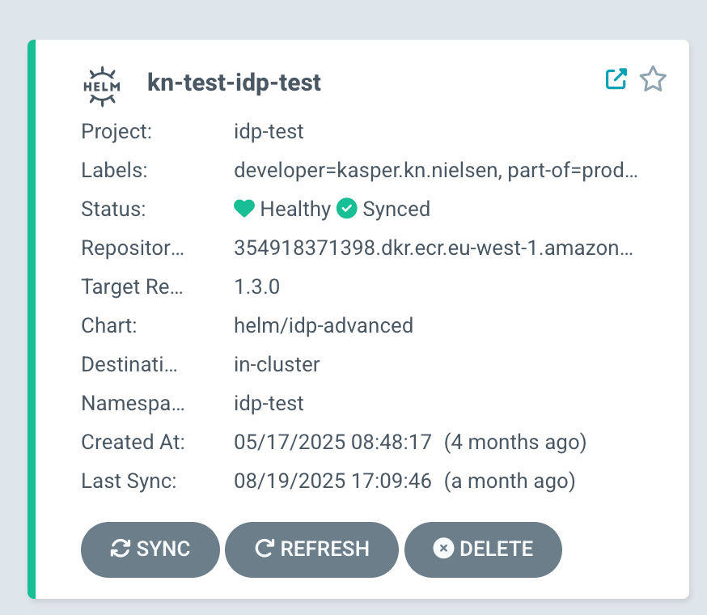
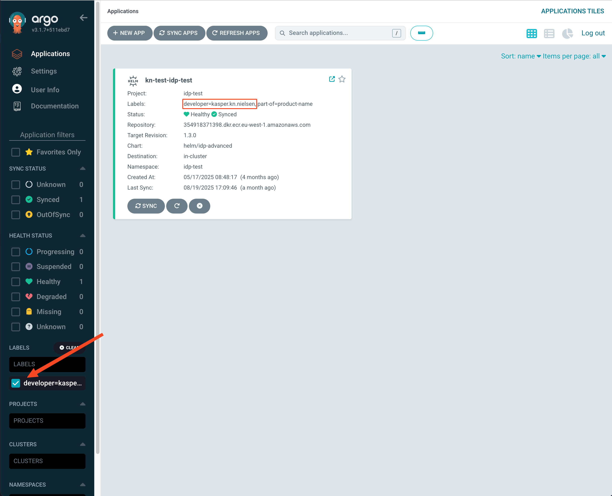

# Add Labels to ArgoCD Applications

## How to Add Labels to Your Application

To add labels to your ArgoCD application, you need to modify your `application.yaml` file by adding a `labels` section.

### Supported Characters in Labels

Labels in ArgoCD follow Kubernetes label syntax constraints:

- Key names must be 63 characters or less
- Keys can only contain alphanumeric characters, dashes (`-`), underscores (`_`), and dots (`.`)
- Keys must start and end with an alphanumeric character

For example: `team-name`, `product_category`, and `version.number` are all valid label keys.

### Example:

```yaml
apiVersion: v2
name: my-application
description: My application description
version: 0.1.0
# Add your labels here
labels:
  part-of: product-name
  team: frontend-team
helm:
  chart: helm/idp-advanced
  chartVersion: "1.5.0"
slack_channel: my-team-slack
```

## How Labels Appear in ArgoCD

Once you've added labels to your application and deployed it, the labels will be visible in the ArgoCD UI as shown in the screenshot below:



## Filtering Applications by Labels in ArgoCD

One of the most useful features of labels is the ability to filter applications in the ArgoCD UI:

1. In the ArgoCD UI, navigate to the Applications view
2. Look for the filter box in the top section of the UI
3. Enter a label selector in the format `label=value` (e.g., `part-of=kasper`)
4. The UI will show only applications with that label



## Best Practices
When implementing labels, follow these best practices:

- Use consistent naming conventions for labels
- Don't create too many labels - focus on those that provide the most value
- Ensure labels are consistently applied across all applications
- Document your labeling strategy
- Use automation to enforce labeling standards
