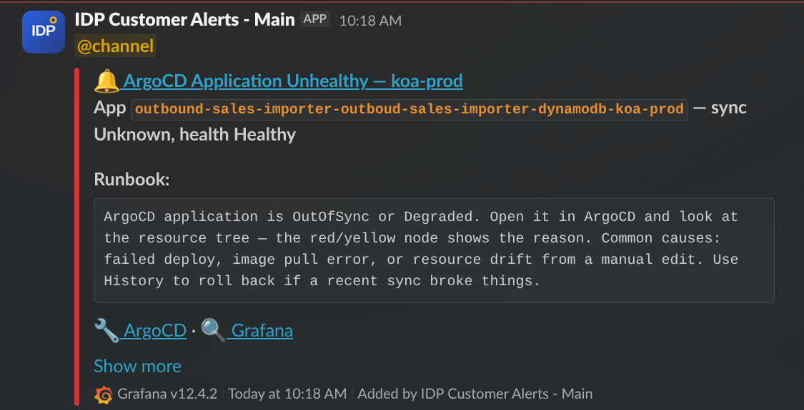
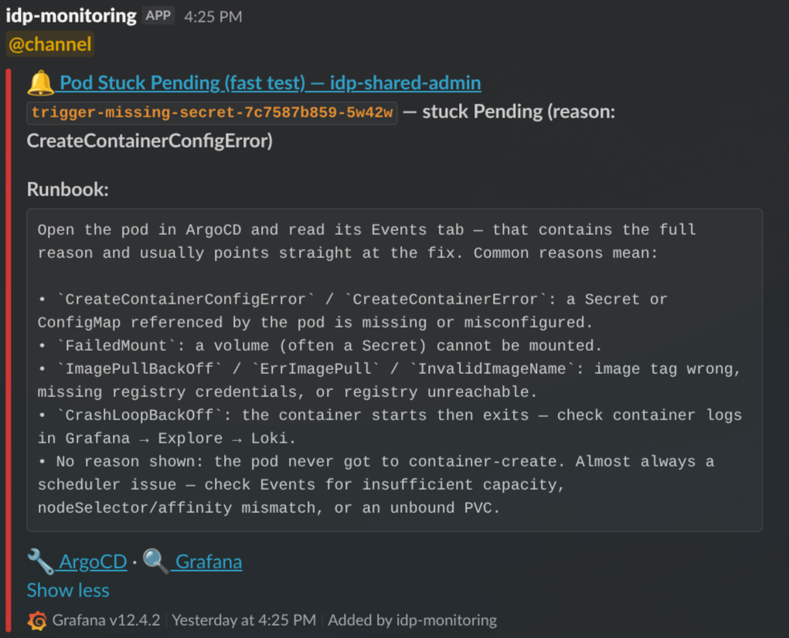

# IDP-Managed Alerts

# Table of Contents
- [What this is](#what-this-is)
- [Standard alert set](#standard-alert-set)
- [What the alerts look like in Slack](#what-the-alerts-look-like-in-slack)
- [Getting started](#getting-started)
  - [Step 1: Request a Slack contact point](#step-1-request-a-slack-contact-point)
  - [Step 2: Deploy the chart in your apps repo](#step-2-deploy-the-chart-in-your-apps-repo)
  - [Step 3: Verify end-to-end with a self-test](#step-3-verify-end-to-end-with-a-self-test)
- [Configuring alerts](#configuring-alerts)
  - [Disabling an alert](#disabling-an-alert)
  - [Adjusting severity](#adjusting-severity)
  - [Adjusting thresholds and durations](#adjusting-thresholds-and-durations)
- [Slack routing](#slack-routing)
  - [How messages reach your channel](#how-messages-reach-your-channel)
  - [Message format](#message-format)
  - [Repeat notifications](#repeat-notifications)
  - [Resolve-and-refire on chart upgrades](#resolve-and-refire-on-chart-upgrades)
  - [Changing the Slack channel](#changing-the-slack-channel)
  - [@channel / @here mentions](#channel--here-mentions)
- [Troubleshooting](#troubleshooting)
- [Relationship to other alerting options](#relationship-to-other-alerting-options)
- [References](#references)

# What this is

IDP maintains a curated set of standard infrastructure alerts that customer teams can opt into per namespace. The alerts cover common Kubernetes-level problems that apply to any workload — OOM kills, crashing containers, pods stuck pending or terminating, PVC disk usage, ArgoCD application health. They are not application-specific: each alert is defined once by IDP and shipped to every opted-in customer via a versioned Helm chart (`idp-managed-customer-alerts`).

**What IDP owns:** the alert queries, the Slack message format, runbooks, and any future additions to the set. A chart version bump automatically improves every customer's alerts on the next sync.

**What you control:** which alerts are enabled for your namespace, their severity, and numeric thresholds (restart counts, pending durations, PVC usage percentages). You do **not** edit the underlying queries — that keeps the managed set consistent across the platform.

Use this alongside your own team-specific alerts (built with [`idp-grafana-alarm`](/alerting#setting-up-alerts-as-code-helm-chart) or the Grafana UI) — both route to the same Slack channel.

# Standard alert set

| Alert | Default severity | Fires when | Customer-tunable |
|-------|------------------|------------|------------------|
| `oomkilled` | warning | A container in your namespace terminates with `OOMKilled` (event-based, fires immediately) | enabled, severity |
| `containerRestartLoop` | warning | A container restarts ≥ N times within 5 minutes (excludes OOMKilled, which has its own alert) | enabled, severity, `restartThreshold` |
| `podPendingWarning` | warning | A pod is stuck in `Pending` longer than the configured duration (default 5 min) | enabled, severity, `durationSeconds` |
| `podPendingMajor` | major | A pod is stuck in `Pending` longer than the configured duration (default 15 min). Disabled by default | enabled, severity, `durationSeconds` |
| `podTerminatingWarning` | warning | A pod is stuck in `Terminating` longer than the configured duration (default 5 min) | enabled, severity, `durationSeconds` |
| `podTerminatingMajor` | major | A pod is stuck in `Terminating` longer than the configured duration (default 15 min) | enabled, severity, `durationSeconds` |
| `pvcUsage` | warning / critical | PVC disk usage crosses `warningPercent` (default 80%) or `criticalPercent` (default 90%) | enabled, thresholds |
| `argocdAppUnhealthy` | warning | Any ArgoCD `Application` targeting your namespace is `OutOfSync`, `Degraded`, `Missing`, or `Unknown` for longer than `forDuration` (default 15 min) | enabled, severity, `forDuration` |

Slack messages include a title with severity emoji and alert name, a bold summary with the offending pod/PVC/app identifier, a runbook section, and links to the relevant Grafana dashboard, the alert in Grafana, and ArgoCD. The pod-pending and restart-loop alerts additionally decode the container's waiting reason (e.g. `CreateContainerConfigError`, `ImagePullBackOff`) so you can triage before opening Grafana.

# What the alerts look like in Slack

> The screenshots below are snapshots taken at the time this guide was written. They illustrate the typical shape of an alert — the exact layout, links, and runbook wording evolve over time and may look different when you see them in your channel.

**Example: ArgoCD Application Unhealthy.**



A typical alert: severity emoji and alert name in the title, a summary line with the offending identifier (here the ArgoCD `Application` name and its sync/health state), a runbook block with first-response guidance, and action links to open the resource directly in ArgoCD and Grafana. The `Show more` link at the bottom is Slack's own affordance — click it to see any additional metadata Slack has folded away. **If the action links (`ArgoCD`, `Grafana`) don't appear on a message, click "Show more" to reveal them** — Slack sometimes collapses the links section by default. This is a Slack rendering behaviour, not a chart bug.

**Example: Pod Stuck Pending with reason decoded.**



For pod-pending and restart-loop alerts, the runbook decodes the container's waiting reason into plain-English troubleshooting steps. The identifier line (`trigger-missing-secret-7c7587b859-5w42w — stuck Pending (reason: CreateContainerConfigError)`) tells you which pod and why; the runbook tells you where to look next.

# Getting started

## Step 1: Request a Slack contact point

IDP owns the Slack contact points centrally — one per environment, shared between the managed alerts and any manual alerts you create in the Grafana UI. This avoids duplicate notifications and keeps the webhook URL under central governance.

Contact the IDP team on Slack with:

- Your team/product name
- The Slack channel alerts should post to, per environment (e.g. `#myteam-dev-alerts`, `#myteam-test-alerts`, `#myteam-prod-alerts`)

IDP will configure the contact point in Grafana and let you know the exact `contactPointRef` name to use in your values file (typically `"Slack - <Team> <env>"`).

## Step 2: Deploy the chart in your apps repo

In your `apps-<team>` repo, create a directory under `apps/<namespace>/idp-managed-alerts/` — one per namespace you want the alerts to cover (typically one per environment):

**`application.yaml`:**

```yaml
apiVersion: v2
name: idp-managed-alerts
description: IDP-managed standard alerts for <namespace>
version: 0.1.0
helm:
  chart: helm/idp-managed-customer-alerts
  chartVersion: "2.4.0"  # see latest at https://github.com/jppol-idp/helm-idp/releases
```

**`values.yaml`:**

```yaml
contactPointRef: "Slack - MyTeam dev"
```

That's the full minimal config. The chart infers your namespace from the ArgoCD release (one chart instance per namespace) and enables the default alert set with the default severities and thresholds shown in the [standard alert set](#standard-alert-set) table above. Commit and push — ArgoCD picks it up on the next sync.

After deploy you'll find a new Grafana folder named `idp-managed-customer-alerts-<namespace>` containing the active alert rules.

## Step 3: Verify end-to-end with a self-test

Alerts in Grafana don't prove that Slack routing works — they only prove the rule evaluated. To confirm a message actually reaches your channel, enable the built-in self-test:

```yaml
contactPointRef: "Slack - MyTeam dev"
standardAlerts:
  selfTest:
    enabled: true
```

Commit. Within one sync cycle an alert named `Self-test alert (<namespace>)` fires continuously and posts to your channel using the real message template. Once you see it land, set `selfTest.enabled: false` and commit again.

# Configuring alerts

All tuning happens in your `values.yaml` under `standardAlerts.<alertKey>`.

## Disabling an alert

Set `enabled: false` on any alert you don't want:

```yaml
contactPointRef: "Slack - MyTeam prod"
standardAlerts:
  argocdAppUnhealthy:
    enabled: false    # Your team runs its own ArgoCD health checks
  podPendingMajor:
    enabled: false    # You're fine with just the warning-level pending alert
```

Omitting a key entirely leaves it at the chart default (see the [standard alert set](#standard-alert-set) table — most are enabled by default, a couple are off).

## Adjusting severity

Override `severity` to escalate or de-escalate an alert. Valid values: `info`, `warning`, `major`, `critical`.

```yaml
standardAlerts:
  oomkilled:
    severity: critical    # OOMs are pager-worthy for this workload
```

Severity controls the emoji in the Slack message and the `severity` label on the alert. It does **not** change routing — all alerts from this chart go to the contact point named in `contactPointRef`.

## Adjusting thresholds and durations

Each alert exposes the knobs listed in the [alert set table](#standard-alert-set). Examples:

```yaml
standardAlerts:
  # Fire restart-loop alert at 5 restarts instead of the default 3
  containerRestartLoop:
    restartThreshold: 5

  # Give terminating pods 10 minutes before the warning and 30 before major
  podTerminatingWarning:
    durationSeconds: 600
  podTerminatingMajor:
    durationSeconds: 1800

  # Tighten PVC thresholds for a critical storage tier
  pvcUsage:
    warningPercent: 70
    criticalPercent: 85

  # ArgoCD apps often deploy slowly in prod — give them longer
  argocdAppUnhealthy:
    forDuration: 30m
```

The PromQL itself is not exposed — if you need a query change, open a request with the IDP team.

# Slack routing

## How messages reach your channel

```
Alert rule (this chart)  ──► GrafanaContactPoint (IDP-owned)  ──►  Slack webhook  ──►  your channel
      (your namespace)        (monitoring namespace)                (IDP-administered)
```

The chart renders only alert rule groups and a per-namespace folder. The contact point — including the webhook URL, message title/text templates, and Slack app governance — lives in `idp-eks-tooling` and is maintained by IDP. Any manual Grafana-UI alerts you create and route to the same contact point render with the identical message format.

## Message format

IDP owns the Slack title/text template and iterates on it centrally — severity emoji, identifier, runbook section, and links layout are uniform across every team using the managed alerts. You don't configure this in your values file.

Because the template lives on the contact point, **every alert routed to a given contact point renders the same way** — including manual alerts you create in the Grafana UI against the same receiver. That consistency is the point: on-call engineers see the same layout regardless of which team or alert source fired.

If your team wants a custom message format (e.g. a stripped-down one-liner, or extra fields specific to your product), that has to live on its own contact point routed to its own Slack channel. It can't share a channel with IDP-managed alerts — the template is all-or-nothing per contact point. Talk to the IDP team if you have that need and we'll figure out whether it fits the platform or makes more sense for your team to run separately.

## Repeat notifications

A firing alert that doesn't resolve on its own will re-post to Slack roughly every **4 hours** until the underlying condition clears. This is Grafana's default re-notification interval and is intentional — it keeps unresolved incidents visible without being noisy. If you see the same alert reappear in your channel hours after the first notification, that's the repeat, not a new incident.

Options if an alert is firing and you don't plan to fix it right now:

- **Fix or mitigate** the issue so the condition clears — the alert auto-resolves.
- **Silence it in Grafana** (Alerting → Silences) for a specific window if you're deliberately ignoring it (planned maintenance, known-bad test env, etc.).
- **Disable the alert** in your values.yaml (`standardAlerts.<key>.enabled: false`) if it's permanently not useful for your workload.

## Resolve-and-refire on chart upgrades

When IDP publishes a new chart version and ArgoCD rolls it out to your namespace, you may see currently-firing alerts **resolve and then immediately re-fire** in Slack — you'll get a `:white_check_mark: Resolved` message followed within seconds by the usual firing message for the same alert.

This is expected Grafana behaviour, not an incident recurring. Alert state is keyed by rule identity (UID + labels + evaluation fingerprint). When the alert rule group is replaced during an upgrade — or when labels, annotations, or queries change between chart versions — Grafana can no longer correlate the new rule with the old firing state, so it treats the in-flight alert as resolved and then evaluates the new rule, which fires again.

If the timestamps on the resolved/refire pair are within a minute of each other and tied to a chart bump, it's this behaviour. Nothing to action — the underlying condition never changed.

## Changing the Slack channel

The default is one channel per environment — `#myteam-dev-alerts`, `#myteam-test-alerts`, `#myteam-prod-alerts` — which keeps noisy non-prod alerts out of the prod channel. If that suits you, no action needed.

If you'd rather consolidate (e.g. dev and test into a shared non-prod channel, or everything into one), how you do it depends on where your environments run:

- **Namespaces in the same cluster** share a Grafana and its contact points. Just point their `contactPointRef` at the same contact point in your values files — no IDP action needed, as long as that contact point already exists. Example: if `myteam-dev` and `myteam-test` both live in `idp-shared-test`, setting `contactPointRef: "Slack - MyTeam nonprod"` in both values files routes both namespaces' alerts to the same channel.
- **Namespaces in different clusters** each have their own Grafana, so you can't share a contact point from values alone. Contact the IDP team on Slack and say which channel each environment should post to — we update the webhook URL on the relevant contact points and the change takes effect immediately (no redeploy on your side).

Got a setup that doesn't fit either pattern? Reach out to the IDP team on Slack and we'll take a look together. We may ask you to adjust the request if it falls far outside the standard patterns — keeping the setup consistent across teams is what makes the managed alerts sustainable to run — but we'd rather have the conversation than leave you stuck.

## @channel / @here mentions

Some teams want alerts to ping the whole channel (`@channel`) or just whoever's online (`@here`); others find it noisy and prefer silent messages. This is set on the contact point itself, not in your values file, so it's a per-environment setting.

Common choices:

- **No mention** (silent) — appropriate for non-prod channels and for teams that don't use Slack as their primary on-call path.
- **`@here`** — pings online channel members. A middle ground for prod when you have an on-call rotation but don't want to wake people up who are explicitly away.
- **`@channel`** — pings everyone regardless of presence. Useful for prod channels that act as the last line of defence; avoid on non-prod or you'll train people to mute the channel.

Tell the IDP team on Slack which behaviour you want per environment and we'll update the contact point. Change takes effect immediately, no redeploy.

Mentions are set per environment (per contact point), not per alert — all alerts from a given environment currently get the same treatment. We don't support per-alert or per-severity mentions today, but it's something we could add if enough teams want it. Let us know if that would be useful.

# Troubleshooting

**No alerts appear in the Grafana folder after deploy.** First check that the ArgoCD application is Healthy and Synced. If it is but the folder is empty (or missing rules), the most common cause is a `contactPointRef` typo — the value must match the contact point's `spec.name` exactly, including spacing and casing. Double-check the name IDP gave you, update your values file, and resync. If that doesn't fix it, contact the IDP team.

**Alert rule group stays in error state after a contact-point change.** The grafana-operator can cache provisioning errors after a contact-point rename or re-point, and won't recover on its own even once the underlying issue is fixed. Contact the IDP team — we can force a re-reconcile cluster-side.

**Alerts fire in Grafana but nothing arrives in Slack.** The contact point or its webhook is broken — contact the IDP team. The self-test uses the same routing, so enabling it won't help diagnose this.

**Dashboard link in a Slack message 404s.** Report it to the IDP team — dashboard UIDs are baked into the chart, so a broken link means either the dashboard was renamed or a new cluster is missing it.

Not sure whether something is a bug, a misconfiguration, or just how the alerts are supposed to behave? Ping us on Slack — we'd rather hear from you one time too many than have you stuck guessing. We're happy to take a look together.

# Relationship to other alerting options

- **This chart (`idp-managed-customer-alerts`)** — opinionated, curated, IDP-maintained. Opt in, override thresholds, get platform-wide improvements for free.
- **[`idp-grafana-alarm`](/alerting#setting-up-alerts-as-code-helm-chart)** — generic building block for your own team-specific alerts (export YAML from Grafana, paste into values). You write the PromQL.
- **Grafana UI** — ad-hoc or exploratory alerts. Route them to the same contact point and they share the Slack format with the managed alerts.

All three can run side-by-side in the same namespace.

# References

- [Chart source and releases](https://github.com/jppol-idp/helm-idp/tree/main/charts/idp-managed-customer-alerts)
- [values.yaml schema (latest)](https://public.docs.idp.jppol.dk/schemas/idp-managed-customer-alerts/latest.json) — pin a specific version in your values.yaml `$schema` comment
- [Working with Alerting](/alerting) — general Grafana alerting guide and `idp-grafana-alarm` usage
