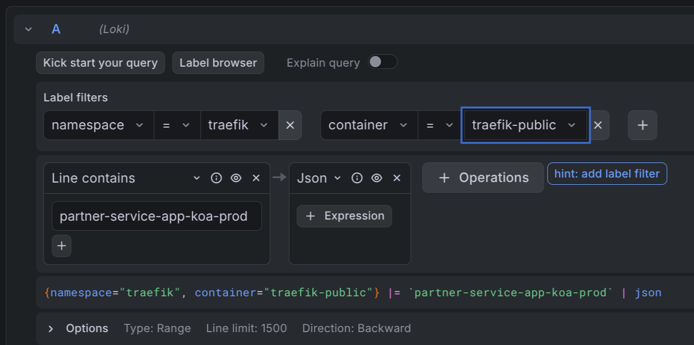

# Reading ingress access logs in Grafana

Every request that reaches your application through the public ingress is logged by the ingress controller and shipped to Loki. This guide shows you how to find those logs in Grafana, how to filter them, and — most importantly — how to read the fields so you can answer your own "why did this request get a 403?" questions.

## Table of contents
- [Where to find the logs](#where-to-find-the-logs)
- [The one thing you need to know: Downstream vs Origin](#the-one-thing-you-need-to-know-downstream-vs-origin)
- [Example queries](#example-queries)
- [Most useful fields](#most-useful-fields)
- [Full field reference](#full-field-reference)
- [Private ingress logs](#private-ingress-logs)
- [Getting help](#getting-help)

## Where to find the logs

1. Open the Grafana for your cluster and go to **Explore**
2. In the datasource dropdown, pick **Loki**
3. Use this base query to see all public ingress logs:

    ```logql
    {namespace="traefik", container="traefik-public"} | json
    ```

The `| json` part parses each log line so you can filter on the individual JSON fields. Without it, you can only do plain text search.

### Filter the raw line first, then parse JSON

The public ingress handles a lot of traffic, and running `| json` on every log line is expensive — Loki has to parse each entry before it can filter on a field. Almost every query in this guide will run noticeably faster if you first narrow the log stream with a **line filter** (a simple substring match on the raw log line), and only then parse the JSON.

For example, if you only care about requests to `partner-service.koa.jppol.dk`, put the hostname in a line filter before `| json`:

```logql
{namespace="traefik", container="traefik-public"}
  |= "partner-service.koa.jppol.dk"
  | json
```

`|=` does a plain substring match on the raw JSON line. It throws away everything that doesn't mention your hostname before Loki does any JSON parsing at all, which is orders of magnitude cheaper on a busy cluster.

Good line-filter candidates:
- A hostname (FQDN) you own
- A specific client IP
- A status code as a string (e.g. `|= "\"DownstreamStatus\":403"`)
- Any other distinctive substring you can think of

Rule of thumb: **always line-filter first if you can**. Only skip it when you genuinely need to see everything.

### Using the query builder

If you prefer Grafana's visual query builder over writing LogQL by hand, the same filter-then-parse pattern applies. Add the label filters first, then a **Line contains** operation with your hostname (or other substring), and finally a **Json** operation:



The builder shows the resulting LogQL query at the bottom of the panel — handy for learning the syntax.

## The one thing you need to know: Downstream vs Origin

The single most useful insight when debugging ingress logs:

| Field | What it means |
|---|---|
| `DownstreamStatus` | The HTTP status the **client** saw |
| `OriginStatus` | The HTTP status the **backend** returned |

If `OriginStatus` is `0`, the request **never reached your backend**. The ingress middleware blocked it — most commonly an IP allowlist, a rate limit, a redirect, or a TLS/auth failure.

**Example:** a client reports a 403 from your API.

```logql
{namespace="traefik", container="traefik-public"} | json | DownstreamStatus="403"
```

Look at the matching log line:

- `OriginStatus = 0` → the ingress blocked it. Check `RequestHost`, `ClientHost`, and `RouterName` to figure out which rule fired. IP allowlist is the usual suspect.
- `OriginStatus = 403` → your backend actually returned 403. The request reached your app, so debug there.

This distinction is what turns a vague "something returned 403" into an actionable answer in about ten seconds.

## Example queries

All examples target the public ingress. Adjust the host, status, or path to your case. Every example line-filters first, then parses JSON — follow the same pattern in your own queries.

**All requests to one host:**
```logql
{namespace="traefik", container="traefik-public"}
  |= "partner-service.koa.jppol.dk"
  | json
```

**All non-2xx responses to one host:**
```logql
{namespace="traefik", container="traefik-public"}
  |= "partner-service.koa.jppol.dk"
  | json
  | DownstreamStatus!~"2.."
```

**Only requests blocked before reaching the backend (for one host):**
```logql
{namespace="traefik", container="traefik-public"}
  |= "partner-service.koa.jppol.dk"
  |= "\"OriginStatus\":0"
  | json
```
The second line filter is an optimization — it drops any line that doesn't even contain `OriginStatus:0` before Loki parses the JSON.

**Requests from a specific client IP:**
```logql
{namespace="traefik", container="traefik-public"}
  |= "4.175.208.6"
  | json
  | ClientHost="4.175.208.6"
```
The line filter is a rough pre-filter (it also matches if the IP shows up in e.g. `X-Forwarded-For`); the structured filter on `ClientHost` then narrows it to requests where that IP is the actual client.

**Slow requests to one host (total duration > 1 second):**
```logql
{namespace="traefik", container="traefik-public"}
  |= "partner-service.koa.jppol.dk"
  | json
  | Duration > 1000000000
```
`Duration` is in **nanoseconds**. `1000000000` ns = 1 s.

**Top client IPs hitting a host in the last hour:**
```logql
sum by (ClientHost) (
  count_over_time(
    {namespace="traefik", container="traefik-public"}
      |= "partner-service.koa.jppol.dk"
      | json [1h]
  )
)
```

## Most useful fields

These are the fields you will reach for 90% of the time.

| Field | Meaning |
|---|---|
| `DownstreamStatus` | HTTP status returned to the client |
| `OriginStatus` | HTTP status from the backend. `0` = ingress middleware blocked the request |
| `RequestHost` | Hostname the client asked for (e.g. `api.example.com`) |
| `RequestMethod` | `GET`, `POST`, `PUT`, … |
| `RequestPath` | Path and query string (e.g. `/api/v2/users?page=1`) |
| `ClientHost` | Real client IP (resolved from `X-Forwarded-For` when present) |
| `request_User-Agent` | `User-Agent` header — useful for identifying callers |
| `Duration` | Total request time in nanoseconds (ingress + backend + overhead) |
| `OriginDuration` | Time the backend took, in nanoseconds |
| `RouterName` | Which ingress route matched. Embeds namespace, ingress name, host |

## Full field reference

The ingress is configured to emit all default fields in JSON. Three request headers are also kept: `Host`, `User-Agent`, and `X-Forwarded-For`. All other headers are stripped for privacy and size reasons.

### Status and timing

| Field | Meaning |
|---|---|
| `DownstreamStatus` | HTTP status code returned to the client |
| `OriginStatus` | HTTP status code from the backend. `0` when the request was blocked by middleware before reaching the backend |
| `Duration` | Total request duration in nanoseconds |
| `OriginDuration` | Time spent waiting for the backend, in nanoseconds |
| `Overhead` | `Duration - OriginDuration` — time spent inside the ingress itself (middleware, TLS, retries) |
| `RetryAttempts` | Number of times the ingress retried the request against the backend |
| `StartUTC` | Request start time in UTC |
| `StartLocal` | Request start time in the ingress pod's local timezone (same as UTC in our clusters) |

### Request

| Field | Meaning |
|---|---|
| `RequestHost` | Hostname requested by the client |
| `RequestAddr` | Same as `RequestHost` in most cases; includes the port if the client specified one |
| `RequestMethod` | HTTP method |
| `RequestPath` | Path and query string |
| `RequestProtocol` | `HTTP/1.1`, `HTTP/2.0`, … |
| `RequestScheme` | `http` or `https` |
| `RequestPort` | Port the client connected to, if any |
| `RequestContentSize` | Bytes in the request body |
| `RequestCount` | Sequential counter per ingress pod since startup. Useful for ordering, not for rates |
| `request_User-Agent` | `User-Agent` header |

### Response

| Field | Meaning |
|---|---|
| `DownstreamContentSize` | Bytes sent to the client |
| `OriginContentSize` | Bytes received from the backend |
| `GzipRatio` | Compression ratio if the response was gzipped, otherwise `0` |

### Client and TLS

| Field | Meaning |
|---|---|
| `ClientHost` | Real client IP (resolved from `X-Forwarded-For`) |
| `ClientAddr` | `ClientHost:ClientPort` |
| `ClientPort` | Client source port |
| `ClientUsername` | Basic-auth user, or `-` if none |
| `TLSVersion` | TLS version used for the connection (e.g. `1.3`) |
| `TLSCipher` | TLS cipher suite used |

### Routing

| Field | Meaning |
|---|---|
| `RouterName` | Which ingress router matched the request. Format includes entrypoint, namespace, ingress name, and host |
| `ServiceName` | Which backend service the request was routed to |
| `ServiceAddr` | Resolved backend address (pod IP and port) |
| `ServiceURL` | Full backend URL the request was forwarded to |
| `entryPointName` | `web` (port 80) or `websecure` (port 443) |

`ServiceName`, `ServiceAddr`, and `ServiceURL` are only populated when the request was actually routed to a backend. If middleware blocked the request, these fields are missing — another signal that the ingress stopped the request early.

### Labels added by Loki

These aren't part of the JSON log line — they are Loki stream labels you can filter on directly in the `{...}` selector:

| Label | Values |
|---|---|
| `namespace` | Always `traefik` for ingress access logs |
| `container` | `traefik-public` or `traefik-private` |
| `cluster` | The cluster name (e.g. `koa-prod`) |
| `pod` | The ingress pod that handled the request |

## Private ingress logs

If your application uses the private ingress (internal-only, not reachable from the public internet), the exact same fields and queries apply — just swap the `container` label:

```logql
{namespace="traefik", container="traefik-private"} | json
```

## Getting help

If the logs show an `OriginStatus: 0` that you can't explain, or you suspect your traffic is being blocked by an IP allowlist or other ingress middleware, contact the IDP team on Slack. Include the `RequestHost`, `ClientHost`, and a timestamp so we can find the same log line.
