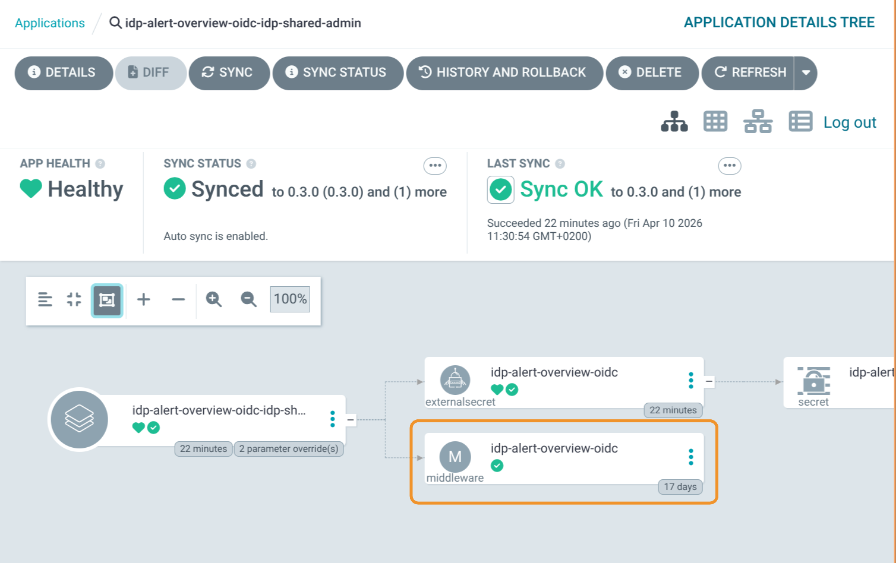

# Adding OIDC authentication to your app

Protect your application with single sign-on against Azure AD / Entra ID without writing any OIDC code in your app. The `idp-oidc-middleware` Helm chart deploys an ingress middleware that handles the full OAuth flow for you and forwards the authenticated user identity as request headers.

**Chart**: `helm/idp-oidc-middleware` from https://github.com/jppol-idp/helm-idp

## Table of contents

- [How it works](#how-it-works)
- [Prerequisites](#prerequisites)
- [Step 1: Order an Entra app registration](#step-1-order-an-entra-app-registration)
- [Step 2: Create the AWS secrets](#step-2-create-the-aws-secrets)
- [Step 3: Deploy the chart](#step-3-deploy-the-chart)
- [Step 4: Reference the middleware from your ingress](#step-4-reference-the-middleware-from-your-ingress)
- [Reading the user identity in your app](#reading-the-user-identity-in-your-app)
- [Bypassing authentication for specific paths](#bypassing-authentication-for-specific-paths)
- [Group-based access control (RBAC)](#group-based-access-control-rbac)
- [Troubleshooting](#troubleshooting)
- [Support](#support)

## How it works

The middleware sits in front of your application's ingress. When an unauthenticated user requests a protected URL:

1. The middleware redirects the browser to Entra ID for login
2. The user authenticates with their JPPol account
3. Entra ID redirects back to `/oauth2/callback` on your domain with an authorization code
4. The middleware exchanges the code for an ID token and stores it in an encrypted session cookie
5. On subsequent requests, the middleware validates the cookie and forwards the user identity to your app via `X-Forwarded-User` and `X-Forwarded-Email` headers
6. Your app reads those headers — no OIDC libraries needed in your code

The middleware also handles logout via `/oauth2/logout`.

## Prerequisites

- An ArgoCD-managed application running in your namespace, exposed via an ingress (`ingress.public.enabled` or `ingress.private.enabled` in your `values.yaml`)
- An AWS Secrets Manager `set-secrets` GitHub Action workflow in your apps repo (already provisioned for all customer namespaces by the platform team)
- Permission to commit to your apps repo

## Step 1: Order an Entra app registration

**You cannot create Entra app registrations yourself.** All app registrations must be ordered through servicedesk so they can be registered against the JPPol tenant with the right ownership and policies.

Open a servicedesk ticket and ask for an **Entra app registration** with all of the following in the same request — including everything up front avoids back-and-forth:

- **Display name**: A descriptive name, e.g. `MyApp Production` (throughout this guide we use the lowercase slug `myapp` in code examples — replace both with values that match your application)
- **Redirect URI**: `https://<your-app-domain>/oauth2/callback`
  - Example: `https://myapp.my-namespace.idp.jppol.dk/oauth2/callback`
  - The path **must** be `/oauth2/callback` exactly — this is what the chart configures by default
- **A client secret** — explicitly ask for one to be generated and shared with you, otherwise you may only receive the IDs
- **Token type**: ID token
- **Optional claims**: `email`, `name`, and `groups` (only request `groups` if you plan to use group-based access control)

When the request is fulfilled you need two values out of the response:

| Value | What it looks like | Used as |
|-------|-------------------|---------|
| **Application (client) ID** | A UUID like `3fe8f2f0-da38-42eb-80c7-febc1d1dcb3f` | `client_id` |
| **Client secret** | A long random string | `client_secret` |

The **directory (tenant) ID** may also appear in the response — you do **not** need it. It is shared across all JPPol Entra apps and is already the chart default.

The exact response format varies. If anything you need is missing — especially the client secret, which is sensitive and may not be sent in the first reply — just respond on the ticket and ask servicedesk to provide it. The client secret is typically shown only once and cannot be retrieved later, so save it immediately to AWS Secrets Manager (next step) and never put it in git or chat.

> **Note:** how the client ID and client secret are actually delivered (in the ticket reply, via a separate secure channel, or by giving you portal access) is up to servicedesk — Entra app management is outside the IDP team's area. If you are unsure how to retrieve them, ask servicedesk on the same ticket.

You will also need a **session secret** — a 32-character random string used to encrypt the session cookie. Generate one yourself:

```bash
openssl rand -hex 16
```

No `openssl`? Any of these work locally — do not use a website, the value must never leave your machine:

```bash
# Python
python3 -c "import secrets; print(secrets.token_hex(16))"

# Node
node -e "console.log(require('crypto').randomBytes(16).toString('hex'))"

# Bash (Linux/Mac, no extra tools)
head -c 16 /dev/urandom | xxd -p
```

Or paste this into your browser's DevTools console:

```javascript
Array.from(crypto.getRandomValues(new Uint8Array(16))).map(b => b.toString(16).padStart(2,'0')).join('')
```

## Step 2: Create the AWS secrets

The chart needs three values in AWS Secrets Manager: `client_id`, `client_secret`, and `session_secret`. Use your namespace's `set-secrets` GitHub Action to create them as **three separate secrets**, one per value.

Open the GitHub Actions tab in your apps repo and find the workflow for your namespace and cluster, e.g. `my-namespace secrets in cluster idp-test`. Run it three times:

| Run | `subpath` input | `value` input |
|-----|-----------------|---------------|
| 1   | `myapp-oidc-client-id` | The client ID from servicedesk |
| 2   | `myapp-oidc-client-secret` | The client secret from servicedesk |
| 3   | `myapp-oidc-session-secret` | A 32-character random string from `openssl rand -hex 16` |

Replace `myapp` with your application name. The full AWS secret paths become:

- `customer/my-namespace/myapp-oidc-client-id`
- `customer/my-namespace/myapp-oidc-client-secret`
- `customer/my-namespace/myapp-oidc-session-secret`

You will reference these paths in the next step.

## Step 3: Deploy the chart

Create a new directory in your apps repo at `apps/<your-namespace>/myapp-oidc/` containing two files.

### application.yaml

```yaml
apiVersion: v2
name: myapp-oidc
description: OIDC middleware for myapp
version: 0.1.0
helm:
  chart: helm/idp-oidc-middleware
  chartVersion: "0.3.0"  # check latest at github.com/jppol-idp/helm-idp/releases
```

Replace `myapp` with your app name. The `chartVersion` shown here is just an example — always pick the [latest released version](https://github.com/jppol-idp/helm-idp/releases).

### values.yaml

```yaml
domain: myapp.my-namespace.idp.jppol.dk
cookieNamePrefix: _MyApp_

bypassPaths:
  - /api/health
  - /metrics

externalSecret:
  separateSecrets:
    clientId:     customer/my-namespace/myapp-oidc-client-id
    clientSecret: customer/my-namespace/myapp-oidc-client-secret
    sessionSecret: customer/my-namespace/myapp-oidc-session-secret
```

Replace:

- `myapp.my-namespace.idp.jppol.dk` with your application's actual domain
- `_MyApp_` with a unique cookie prefix (any short identifier — keeps cookies isolated between apps on the same parent domain)
- `bypassPaths` with the paths in your app that should be reachable without authentication (see [Bypassing authentication for specific paths](#bypassing-authentication-for-specific-paths) for more examples)
- The three `customer/my-namespace/...` paths with the AWS secret paths from step 2

Commit both files. ArgoCD will detect the new application and deploy it automatically.

## Step 4: Reference the middleware from your ingress

The middleware is now deployed but not yet wired to your ingress. Open your existing application's `values.yaml` and add a reference to the middleware in your ingress block:

```yaml
ingress:
  enabled: true
  fqdn:
    - myapp.my-namespace.idp.jppol.dk
  public:
    enabled: true
    middlewares:
      - my-namespace-myapp-oidc@kubernetescrd
```

The reference format is `<your-namespace>-<middleware-name>@kubernetescrd`. The middleware name defaults to your release name (the directory you created in step 3, e.g. `myapp-oidc`).

**Tip:** to look up the actual middleware name, open your `myapp-oidc` application in the ArgoCD UI and find the `Middleware` resource in the resource tree:



The screenshot is from the IDP team's own deployment of this guide for their internal `idp-alert-overview` app, so the directory is named `idp-alert-overview-oidc` instead of `myapp-oidc`. The namespace is `idp-shared-admin` and the middleware name (from the resource tree) is `idp-alert-overview-oidc`, so the full reference becomes:

```
idp-shared-admin-idp-alert-overview-oidc@kubernetescrd
```

If your app uses `ingress.private.enabled` instead of `public`, add the `middlewares:` list under `private:` — same format.

Commit and let ArgoCD apply the change. Within a minute or two, requests to `myapp.my-namespace.idp.jppol.dk` should redirect to Entra ID for login.

## Reading the user identity in your app

After successful login, every request your app receives will have these headers added by the middleware:

| Header | Value |
|--------|-------|
| `X-Forwarded-User` | The user's display name from Entra ID (e.g. `Jane Doe`) |
| `X-Forwarded-Email` | The user's email address (e.g. `jane.doe@jppol.dk`) |

Your app should trust these headers because they come from the in-cluster ingress, not from the client. Make sure your app does **not** accept `X-Forwarded-User` / `X-Forwarded-Email` from arbitrary sources — only via the cluster ingress path.

Example in Python (FastAPI):

```python
from fastapi import FastAPI, Request

app = FastAPI()

@app.get("/")
def home(request: Request):
    user_name = request.headers.get("X-Forwarded-User", "anonymous")
    user_email = request.headers.get("X-Forwarded-Email", "")
    return {"hello": user_name, "email": user_email}
```

## Bypassing authentication for specific paths

Use `bypassPaths` for paths that should be reachable without authentication. Common cases:

- Health checks (`/api/health`, `/healthz`)
- Prometheus metrics (`/metrics`)
- Public webhooks called by external services (e.g. Grafana alert webhooks)
- Static assets like favicon

```yaml
bypassPaths:
  - /api/health
  - /metrics
  - /api/webhook/grafana
  - /favicon.ico
```

Each entry becomes an exact path match. The middleware combines them with logical OR.

## Group-based access control (RBAC)

To restrict access to users in specific Entra ID groups, use `assertClaims`. This requires the Entra app to be configured to send `groups` as an optional claim (request this when ordering the Entra app via servicedesk).

```yaml
authorization:
  assertClaims:
    - name: groups
      anyOf:
        - awssso-myapp-admin
        - awssso-myapp-user
```

Use `anyOf` to require the user to have **at least one** of the listed group display names. Use `allOf` to require **all** of them. You can stack multiple claims:

```yaml
authorization:
  assertClaims:
    - name: groups
      anyOf:
        - awssso-myapp-user
    - name: roles
      allOf:
        - reader
```

Users without the required claims will receive a 403 Forbidden after login.

## Troubleshooting

### Login redirects loop or fail with "redirect_uri_mismatch"

The redirect URI you ordered from servicedesk does not match what the chart sends. The chart sends `https://<domain>/oauth2/callback`. Verify:

- Your `domain` value in `values.yaml` matches your actual ingress hostname exactly (no trailing slash, correct subdomain)
- The Entra app has `https://<domain>/oauth2/callback` as a registered redirect URI (open a servicedesk ticket if it needs to be added or corrected)

### "Invalid session secret" or cookie errors

The `session_secret` must be exactly 32 characters. Generate a new one with `openssl rand -hex 16` (or one of the alternatives shown in [Step 1](#step-1-order-an-entra-app-registration) if you do not have `openssl`) and update the AWS secret using the GitHub Action.

### 403 Forbidden after successful login

Either your `assertClaims` configuration is too strict, or the Entra app is not sending the expected claims. Check the Entra app's optional claims configuration via servicedesk.

### The middleware reports "secret not found"

The Kubernetes Secret created by the External Secrets Operator (ESO) is not yet ready. Verify:

```bash
kubectl get externalsecret -n <your-namespace>
kubectl get secret -n <your-namespace> | grep oidc
```

Both should exist and the ExternalSecret should show `SecretSynced`. If it does not, check the ExternalSecret events for AWS access errors:

```bash
kubectl describe externalsecret <name> -n <your-namespace>
```

### Health checks failing despite bypassPaths

Verify the path in `bypassPaths` is an exact match for what your liveness/readiness probe is hitting. The middleware does not do prefix matching by default.

## Support

For issues or questions:

1. Check ArgoCD: both your main app and the OIDC middleware app should be Synced and Healthy
2. Check ExternalSecret status with `kubectl describe externalsecret <name>`
3. Contact the IDP team on Slack
