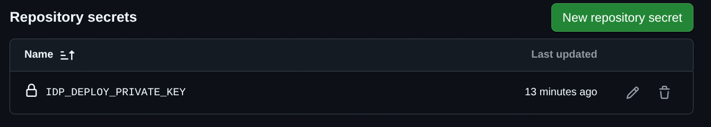
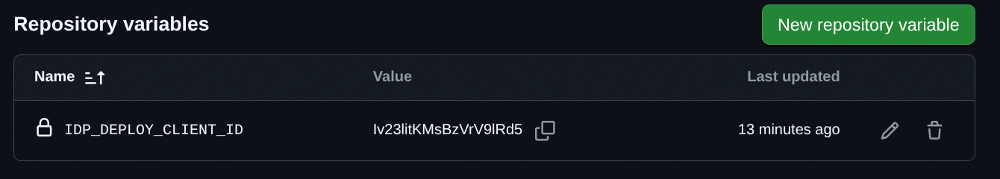
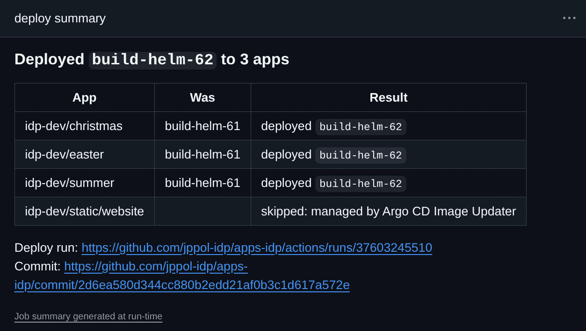
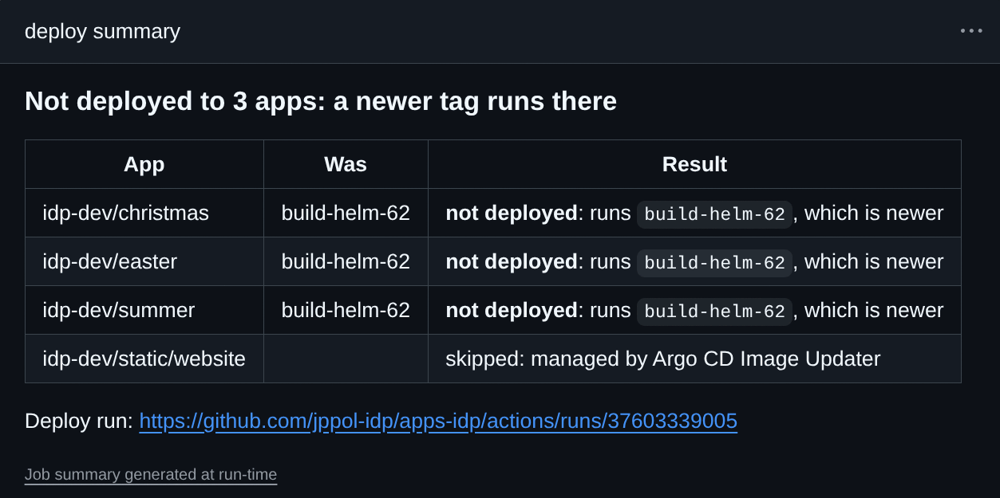
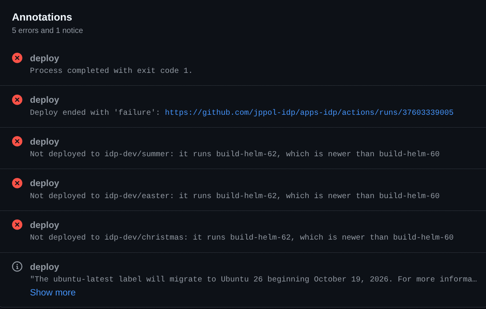
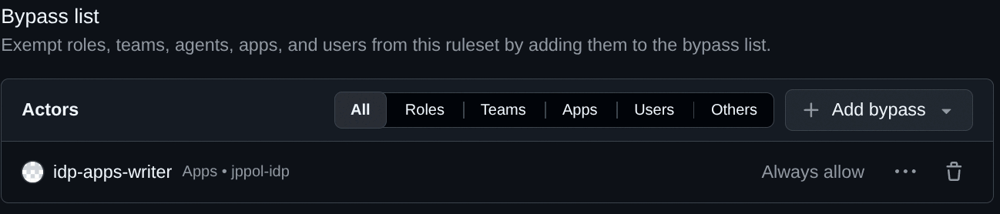
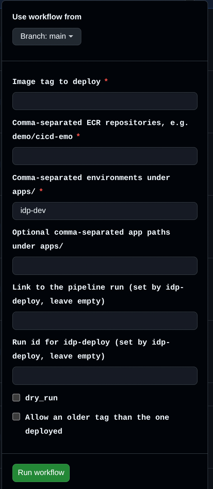

# Deploying from your own pipeline

Your build pipeline can deploy a container image straight to your apps in your IDP cluster. One step at the end of the pipeline updates every app that runs the image, in one commit, and the pods roll within seconds. The result, green or red, shows up in your own pipeline run.

This is an alternative to [Argo CD Image Updater](./auto-updates), which watches ECR and writes a commit per app when a new image appears. You can use both in the same apps repo, but not for the same app.

| | Pipeline deploy | Argo CD Image Updater |
|---|---|---|
| What starts a deploy | Your pipeline, when you decide | A new image in ECR, within a minute or so |
| Several apps on one image | One commit, all at once | One commit per app, one at a time |
| Feedback | In your pipeline run: which apps got the tag, red if not | None in your pipeline; watch Argo CD |
| Control | You choose tag and environments per run | Rules in `application.yaml` (tag pattern, strategy) |
| Fits best | Builds that must land together, promotion between environments, prod | Test environments that should just follow the latest build |

## How it works

A few words that this page uses throughout:

- **Apps repo**: your team's repository in the `jppol-idp` organisation, `jppol-idp/apps-<team>`. Argo CD deploys whatever it finds there.
- **Environment**: a top-level directory under `apps/` in that repo, for example `apps/koa-dev` or `apps/koa-prod`. Each one is a namespace in a cluster.
- **App**: a directory under an environment with an `application.yaml` and a `values.yaml`, for example `apps/koa-dev/customer-overview`. Some teams nest them one level deeper; that works too.
- **Tag**: the image tag in `values.yaml`, the part after the colon in `<registry>/<namespace>/<image>:<tag>`. Changing it is what deploys a new build.

A deploy from your pipeline goes like this:

1. Your pipeline runs the `idp-deploy` action with the image names, the tag and the environments.
2. The action starts the workflow **Update image tags** in your apps repo. The IDP team puts that workflow in your apps repo and maintains it.
3. The workflow finds every app in those environments whose `values.yaml` uses one of the images, checks that the tag exists in ECR, writes the new tag into each `values.yaml`, and pushes one commit to `main`.
4. Argo CD sees the commit and rolls the pods.
5. The action waits for the workflow and shows the outcome in your pipeline run.

Two GitHub Apps are involved, and it helps to know which is which:

- **Your deploy app**, named `<team>-deploy-trigger`, is created by the IDP team for your apps repo only. Its only permission is to start the workflow in step 2. Your pipeline authenticates with its client ID and private key.
- **`idp-apps-writer`** is the IDP team's app that writes the commit in step 3. You never hold its credentials; it only matters if your apps repo protects `main` (see [Rules worth knowing](#rules-worth-knowing)).

## Before you start

- Your apps use the `idp-advanced` chart, so each app has `image.repository` and `image.tag` in its `values.yaml`.
- Your pipeline already pushes images to ECR under your team's prefix, for example `koa/customer-overview`.
- You have asked the IDP team for a deploy app for your apps repo, in your team's onboarding channel on Slack. The IDP team creates the app, adds the **Update image tags** workflow to your apps repo, and hands you the app's client ID and private key through Bitwarden.

## Step 1: Store the credentials

Store the two values where your pipeline runs:

| Name | Type | Value |
|---|---|---|
| `IDP_DEPLOY_CLIENT_ID` | Variable | The client ID, starts with `Iv`. Not a secret, anyone with read access to the repository can see it |
| `IDP_DEPLOY_PRIVATE_KEY` | Secret | The whole `.pem` file, including the `BEGIN` and `END` lines |

For one repository: open the repository on GitHub, then **Settings** > **Secrets and variables** > **Actions**. Add the secret under the **Secrets** tab with **New repository secret**, and the variable under the **Variables** tab with **New repository variable**.





If several repositories in your organisation deploy, store them once at organisation level instead: organisation page > **Settings** > **Secrets and variables** > **Actions**, and limit **Repository access** to the repositories that deploy.

Delete the `.pem` file afterwards. If the key leaks, ask the IDP team to generate a new one; the old one stops working at once.

## Step 2: Check the apps

For each app that your pipeline should deploy, open its directory in your apps repo and check that `values.yaml` names the image your pipeline builds, with an explicit tag:

```yaml
image:
  repository: 354918371398.dkr.ecr.eu-west-1.amazonaws.com/koa/customer-overview
  tag: "1.4.2"
```

That is all for apps that nobody updates automatically today. The tag in `values.yaml` is what runs, and from now on your pipeline changes it.

If the app uses Argo CD Image Updater, switch it over first, or the two will fight over the same tag:

1. Remove every `argocd_image_updater_*` line from `application.yaml`.
2. If the app has a `values-aiu.yaml`, move the `image` section into `values.yaml` and delete `values-aiu.yaml`.
3. Merge it.

The deploy workflow refuses apps that still have Image Updater settings, so this cannot be skipped by accident.

## Step 3: Add the deploy step to your pipeline

Add a job after the one that builds and pushes the image. The deploy job needs the tag the build used, so the build job exposes it as an output:

```yaml
jobs:
  build:
    runs-on: ubuntu-latest
    outputs:
      tag: ${{ steps.meta.outputs.tag }}
    steps:
      - id: meta
        run: echo "tag=1.4.${{ github.run_number }}" >> "$GITHUB_OUTPUT"
      # ... build and push koa/customer-overview:${{ steps.meta.outputs.tag }} to ECR ...

  deploy:
    needs: build
    runs-on: ubuntu-latest
    steps:
      - name: Deploy to apps-koa
        uses: jppol-idp/actions/idp-deploy@update-image-tags-v1.0.0
        with:
          client_id: ${{ vars.IDP_DEPLOY_CLIENT_ID }}
          private_key: ${{ secrets.IDP_DEPLOY_PRIVATE_KEY }}
          apps_repo: apps-koa
          tag: ${{ needs.build.outputs.tag }}
          images: |
            koa/customer-overview
            koa/customer-overview-worker
          environments: koa-dev,koa-test
```

Replace the `koa` names with your own. The action lives in an internal repository and works from any repository in the company's GitHub enterprise. The step needs no `actions/checkout` and does not use the workflow's `GITHUB_TOKEN`.

| Input | Required | What it does |
|---|---|---|
| `apps_repo` | yes | Your apps repo in `jppol-idp`, for example `apps-koa` |
| `tag` | yes | The tag to deploy. Letters, digits, `.`, `_` and `-`, at most 128 characters |
| `images` | yes | ECR repositories without the registry host, exactly as they appear in `image.repository` after `amazonaws.com/`. Comma- or newline-separated. Every app whose `image.repository` matches gets the tag |
| `environments` | yes | Environment directories under `apps/`, comma- or newline-separated |
| `paths` | no | Limit the deploy to these app directories under `apps/`, for example `koa-dev/customer-overview` |
| `dry_run` | no | Show what would change without committing. Same green or red verdict as a real run |
| `force` | no | Deploy even if the app runs a tag that was pushed later. For rollbacks |
| `wait` | no | Default `true`: wait for the deploy and fail if it fails. `false` returns right after starting it |
| `timeout_minutes` | no | How long to wait, default 15 |

Outputs: `updated` (number of apps that got the tag), `commit` (the commit in your apps repo, empty if nothing changed), `run_url` (the deploy run in your apps repo). Use them like `${{ steps.<id>.outputs.updated }}` in later steps.

A complete, working example is in [jppol-idp/deploy-example](https://github.com/jppol-idp/deploy-example).

## Step 4: Run it and read the result

Open the run of your pipeline on GitHub (**Actions** tab > the run). The **summary** box of the deploy job tells you what happened:



A red run always says why, both in the **Annotations** box at the bottom of the run page and in the summary:





The commit in your apps repo is made by `idp-apps-writer[bot]`. Its message lists every app it changed and links back to your pipeline run, so you can always trace a deploy to the build that made it:

![Commit list in the apps repo showing Deploy build-helm-62 and Deploy build-helm-61 by idp-apps-writer[bot]](../assets/pipeline-deploys-commit.png)

Argo CD picks the commit up within seconds and rolls the pods. A green deploy means the tag is committed, not that the new pods are healthy. To see the rollout itself, use [Argo CD notifications in Slack](./argocd-slack-notifications) or the Argo CD UI for your cluster.

## Rules worth knowing

**Same tag again is fine.** Re-running a pipeline that deploys a tag the apps already run gives a green "Already deployed" and no commit.

**An older tag is refused.** If an app runs a tag that was pushed to ECR later than the one you deploy, the app keeps what it has and the run is red: "Not deployed to <app>: it runs <tag>, which is newer than <your tag>". This protects you when two builds finish close together. Age is the image's push time in ECR, so a rollback, or an old image you re-tagged, needs `force: true`.

**One deploy at a time per apps repo.** Deploys queue up, no matter which pipeline started them. If three start within seconds, GitHub cancels the middle one; its run is red with "replaced in the queue, re-run if this tag should still go out". The newest deploy is not affected.

**A protected `main` needs one setting.** If your apps repo requires pull requests on `main` (**Settings** > **Rules** > **Rulesets**), add the GitHub App `idp-apps-writer` to the ruleset's bypass list with **Always allow**. It is the app that writes the deploy commits, the same way `argocd-for-teams` writes Image Updater commits. Without it the run is red with "main in jppol-idp/apps-<team> is protected".



**Each apps repo deploys only its own images and environments.** The deploy workflow accepts images under your ECR prefix and the environments that belong to your apps repo, nothing else.

## Deploying by hand

Anyone with write access to your apps repo can start the same workflow from its **Actions** tab: choose **Update image tags** in the list on the left, then **Run workflow**. Fill in the tag, the images and the environments; leave the fields marked "set by idp-deploy" empty. Useful for a quick rollback with the **force** box ticked, or to try a tag in one environment. The result appears in the run's summary in the same form as in your pipeline.



## Troubleshooting

| Message in your run | Meaning | What to do |
|---|---|---|
| `Tag <tag> not found in ECR repository <image>` | The build did not push that tag, or the tag is spelled differently | Check the build job's output and the `images` input |
| `No app in <env> has image.repository in values.yaml set to: <image>` | No app in those environments uses that image | Check `image.repository` in `values.yaml`; it must be `<registry>/<image>` exactly |
| `Every matching app was skipped: <app> (managed by Argo CD Image Updater)` | The apps still have `argocd_image_updater_*` settings | Finish step 2 for those apps |
| `Not deployed to <app>: it runs <tag>, which is newer` | A later build is already deployed | Nothing, unless you meant a rollback: then `force: true` |
| `main in jppol-idp/apps-<team> is protected` | `main` requires pull requests | Add `idp-apps-writer` to the ruleset bypass list |
| `Could not rebase onto main` | Someone changed the same lines at the same time | Re-run the deploy |
| `Lists must be comma-separated without spaces` | A manual run had a space after a comma | Remove the spaces; the action does this for you in a pipeline |
| `Started the deploy ... but could not find its run` | The **Update image tags** workflow in your apps repo is missing or renamed | Ask the IDP team in your team's onboarding channel on Slack |
| `Resource not accessible by integration` | Your deploy app is not installed on that apps repo, or `apps_repo` is wrong | Check `apps_repo`; otherwise ask the IDP team |
